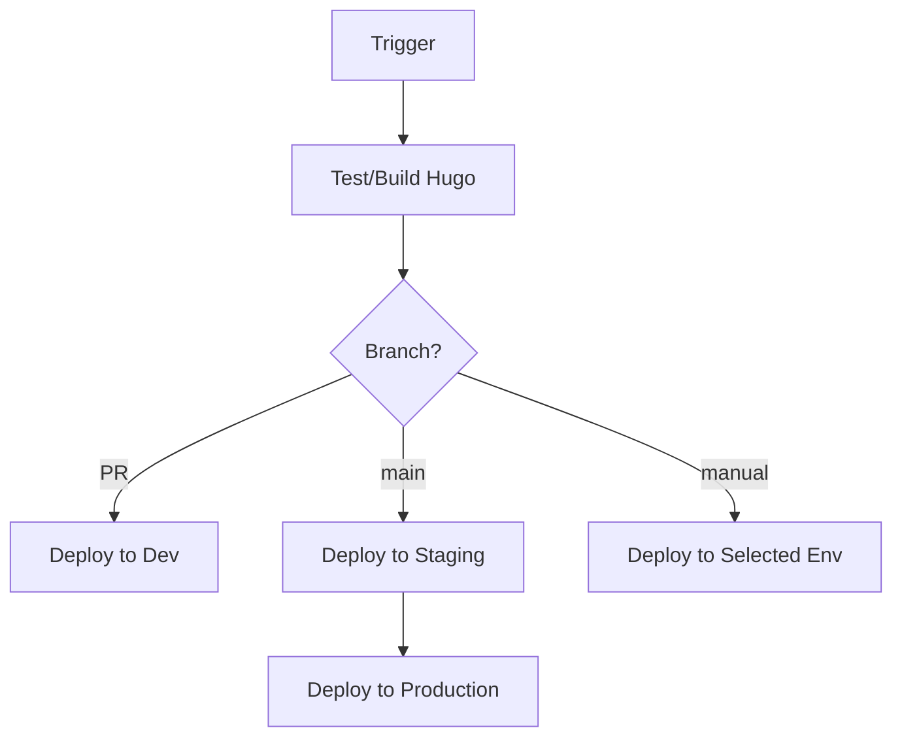

# GitHub Actions Workflows

This directory contains automated workflows for the Support Tools website.

## Workflows

### 1. cloudflare-workers.yml - Cloudflare Workers Deployment

**Purpose**: Deploy the Hugo static site to Cloudflare Workers

**Triggers**:
- **Push to main**: Deploys to staging, then production
- **Pull Request**: Deploys to development for preview
- **Manual dispatch**: Deploy to any specific environment
- **Schedule**: Daily at midnight UTC (content refresh)

**Deployment Flow**:



**Environments**:
- `development` - https://dev.support.tools
- `mst` - https://mst.support.tools
- `qas` - https://qas.support.tools
- `tst` - https://tst.support.tools
- `staging` - https://stg.support.tools
- `production` - https://support.tools

**Environment Protection**:
- Production requires manual approval
- Staging auto-deploys from main branch
- Development auto-deploys for PRs

### 2. pipeline.yml - Legacy Kubernetes Deployment (Deprecated)

**Status**: DEPRECATED - Use cloudflare-workers.yml instead

**Purpose**: Previously deployed to Kubernetes clusters via ArgoCD

## Required Secrets

Configure these in Settings → Secrets → Actions:

- `CLOUDFLARE_API_TOKEN` - API token with Workers:Edit permissions

## Usage Examples

### Manual Deployment

1. Go to Actions tab
2. Select "Deploy to Cloudflare Workers"
3. Click "Run workflow"
4. Select environment
5. Click "Run workflow"

### Automatic Deployments

- **Production**: Push to `main` branch
- **Development**: Create a pull request
- **Daily refresh**: Automatic at midnight UTC

## Monitoring Deployments

### View Logs
```bash
# Real-time logs
wrangler tail --env production

# GitHub Actions logs
gh run list --workflow=cloudflare-workers.yml
gh run view <run-id>
```

### Check Status
```bash
# Check all environments
for env in dev mst qas tst stg ""; do
  url="https://${env}${env:+.}support.tools"
  echo -n "$url: "
  curl -s -o /dev/null -w "%{http_code}\n" $url
done
```

## Rollback Procedure

1. **Via GitHub**:
   ```bash
   # List recent deployments
   gh run list --workflow=cloudflare-workers.yml --limit 10
   
   # Re-run a previous successful deployment
   gh run rerun <run-id>
   ```

2. **Via Wrangler**:
   ```bash
   # List versions
   wrangler deployments list
   
   # Rollback to previous version
   wrangler rollback --env production
   ```

## Troubleshooting

### Deployment Fails

1. Check GitHub Actions logs
2. Verify CLOUDFLARE_API_TOKEN is set
3. Check Hugo build output
4. Verify DNS is pointing to Cloudflare

### Site Not Updating

1. Clear Cloudflare cache
2. Check if deployment completed
3. Verify correct environment deployed
4. Check Workers logs: `wrangler tail`

### Performance Issues

1. Check Workers analytics in Cloudflare Dashboard
2. Monitor request duration in logs
3. Verify static assets are cached
4. Check for large unoptimized images

## Migration from Kubernetes

The site has been migrated from Kubernetes to Cloudflare Workers:

- **Old**: Docker → Kubernetes → ArgoCD → Nginx
- **New**: Hugo → Cloudflare Workers → Global CDN

Benefits:
- ✅ Free hosting for static assets
- ✅ Global edge deployment
- ✅ No infrastructure to manage
- ✅ Faster deployment times
- ✅ Better performance