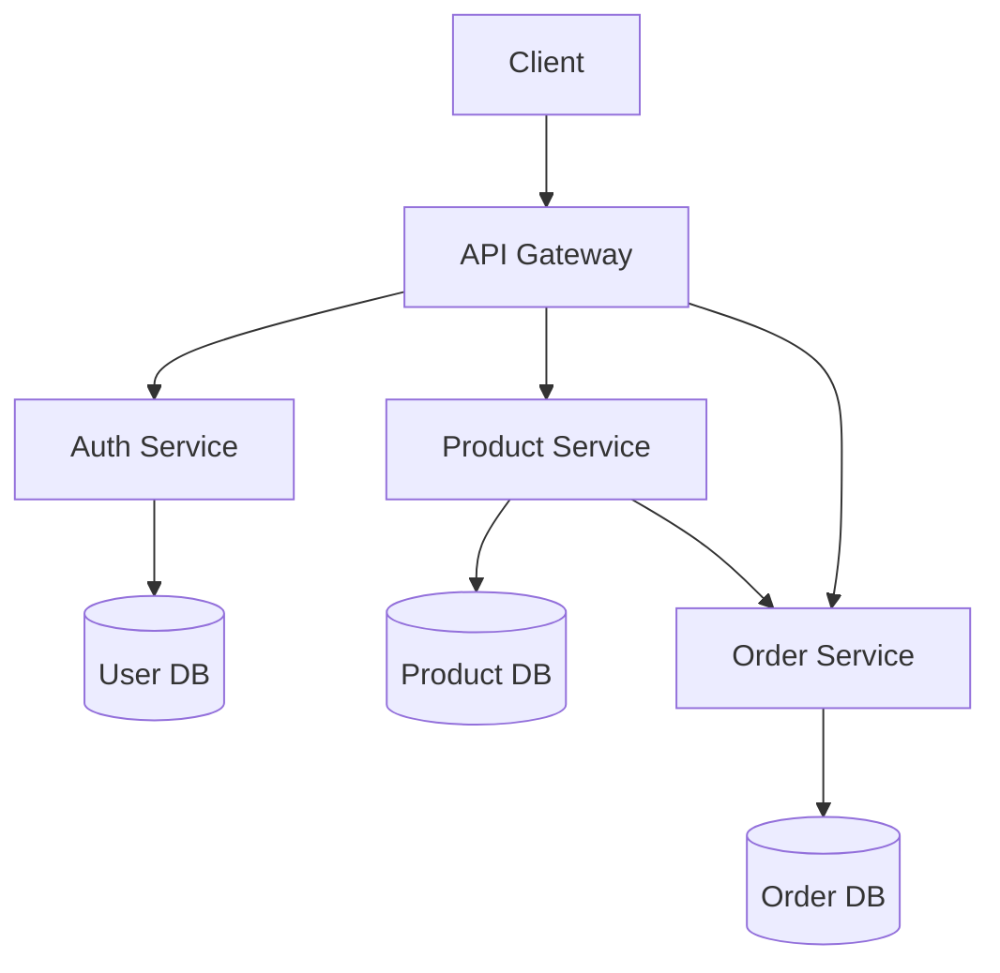
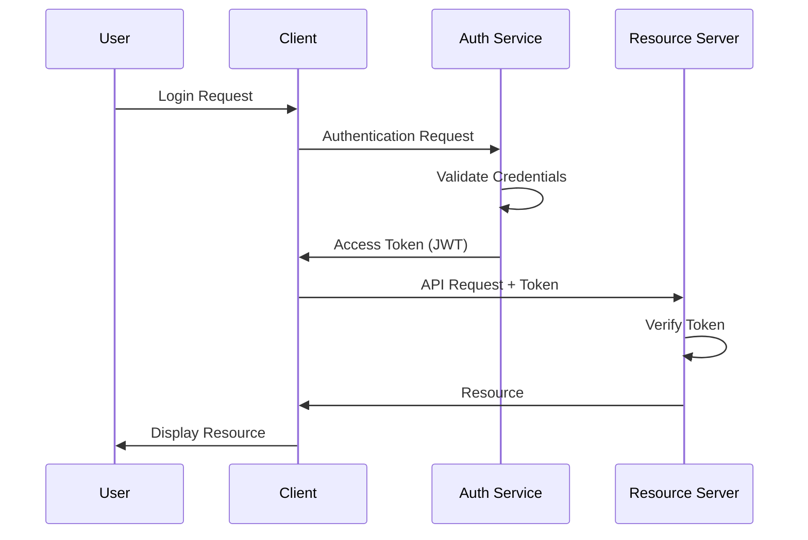

Technical documentation is a critical component of modern software projects. While Markdown provides an excellent format for writing and maintaining documentation in code repositories, many situations require PDF output for formal distribution, compliance requirements, or offline reading. This guide will show you how to build a powerful Markdown to PDF conversion toolkit that supports advanced features.

<!--more-->

# Advanced Markdown to PDF Conversion: Supporting Mermaid, Emoji, and TOC

## The Challenge with Markdown to PDF Conversion

Markdown is the de facto standard for technical documentation in code repositories, but converting it to polished PDF documents presents several challenges:

1. **Diagram Support**: Technical documentation often requires diagrams, which Markdown doesn't natively support
2. **Emoji Rendering**: Modern documentation frequently uses emojis for visual signposting and improved readability
3. **Table of Contents**: Longer documents need automatically generated, clickable tables of contents
4. **Consistent Styling**: Professional PDFs require consistent styling and formatting across all documents
5. **Automation**: Conversion should be automatable for integration into CI/CD pipelines

While basic Markdown to PDF conversion tools exist, they often fall short on supporting these advanced features, especially when it comes to rendering Mermaid diagrams, custom emojis, and automatically generating tables of contents.

## Available Solutions and Their Limitations

Several approaches exist for converting Markdown to PDF:

| Approach | Pros | Cons |
|----------|------|------|
| Pandoc | Powerful, supports many formats | Complex setup, limited Mermaid support |
| Browser extensions | Easy to use | Manual process, inconsistent results |
| VS Code extensions | Good rendering, preview | Requires VS Code, manual process |
| md-to-pdf | Simple Node.js library | Limited diagram support, no TOC generation |
| Specialized services | Professional results | Often requires payment, potential data privacy issues |

After evaluating various options, we found that combining several open-source libraries provides the most flexible and powerful solution while maintaining full control over the conversion process.

## Building Our Conversion Toolkit

We'll build a toolkit that combines the best aspects of several libraries:

1. **md-to-pdf-ng**: An extended version of md-to-pdf with Mermaid diagram support
2. **node-emoji**: For emoji rendering beyond Unicode
3. **doctoc**: For automatic table of contents generation
4. **Custom styling**: For professional, consistent document appearance

This approach gives us full control over the conversion process and allows for integration into CI/CD pipelines or developer workflows.

### Setting Up the Project

First, let's create a new project and install the required dependencies:

```bash
mkdir markdown-pdf-toolkit
cd markdown-pdf-toolkit
npm init -y

# Install core dependencies
npm install md-to-pdf-ng node-emoji doctoc

# Optional: Add linting support
npm install textlint textlint-rule-no-dead-link textlint-rule-terminology --save-dev
```

Next, create a simple project structure:

```
markdown-pdf-toolkit/
├── config.js          # Markdown conversion configuration
├── convert.js         # Conversion script
├── package.json       # Node.js project file
├── styles/            # CSS styling for PDF output
│   └── custom.css     # Custom styles
├── md/                # Source Markdown files
│   └── example.md     # Example document
└── pdf/               # Output directory for PDF files
```

### Configuring the Markdown Renderer

Create a `config.js` file to configure the markdown renderer with emoji support:

```javascript
const marked = require('marked');
const { emojify } = require('node-emoji');

// Create custom renderer with emoji support
const renderer = new marked.Renderer();
renderer.text = emojify;

// Export configuration for md-to-pdf-ng
module.exports = {
  // Configure markdown options
  marked_options: { 
    renderer,
    headerIds: true,
    gfm: true 
  },
  
  // PDF output styling
  css: `
    body {
      font-family: 'Arial', sans-serif;
      line-height: 1.6;
      max-width: 980px;
      margin: 0 auto;
      padding: 45px;
    }
    
    h1, h2, h3, h4, h5, h6 {
      color: #333;
      margin-top: 24px;
      margin-bottom: 16px;
      font-weight: 600;
    }
    
    h1 { font-size: 2em; border-bottom: 1px solid #eaecef; padding-bottom: 0.3em; }
    h2 { font-size: 1.5em; border-bottom: 1px solid #eaecef; padding-bottom: 0.3em; }
    
    code {
      background-color: rgba(27, 31, 35, 0.05);
      border-radius: 3px;
      font-family: "SFMono-Regular", Consolas, "Liberation Mono", Menlo, monospace;
      font-size: 85%;
      padding: 0.2em 0.4em;
    }
    
    pre {
      background-color: #f6f8fa;
      border-radius: 3px;
      font-family: "SFMono-Regular", Consolas, "Liberation Mono", Menlo, monospace;
      font-size: 85%;
      line-height: 1.45;
      overflow: auto;
      padding: 16px;
    }
    
    blockquote {
      border-left: 4px solid #dfe2e5;
      color: #6a737d;
      padding: 0 16px;
      margin: 0;
    }
    
    table {
      border-collapse: collapse;
      width: 100%;
      margin-bottom: 16px;
    }
    
    table, th, td {
      border: 1px solid #dfe2e5;
    }
    
    th, td {
      padding: 8px 13px;
      text-align: left;
    }
    
    th {
      background-color: #f6f8fa;
      font-weight: 600;
    }
    
    .mermaid {
      text-align: center;
    }
  `,
  
  // Configure PDF options
  pdf_options: {
    format: 'A4',
    margin: {
      top: '40px',
      right: '40px',
      bottom: '40px',
      left: '40px'
    },
    printBackground: true,
    headerTemplate: '<div style="font-size: 8px; margin: 0 auto;"></div>',
    footerTemplate: '<div style="font-size: 8px; margin: 0 auto; text-align: center; width: 100%;"><span style="color: #444;">Page <span class="pageNumber"></span> of <span class="totalPages"></span></span></div>'
  },
  
  // Wait for network resources to load
  launch_options: {
    args: ['--no-sandbox', '--disable-setuid-sandbox']
  },
  
  // Default mermaid theme
  mermaid_options: {
    theme: 'default'
  }
};
```

### Creating a Conversion Script

Now, create a `convert.js` script to handle the conversion process:

```javascript
#!/usr/bin/env node

const path = require('path');
const fs = require('fs');
const util = require('util');
const { execSync } = require('child_process');
const { mdToPdf } = require('md-to-pdf-ng');

// Ensure output directory exists
if (!fs.existsSync('./pdf')) {
  fs.mkdirSync('./pdf');
}

// Get all .md files from the md directory
const mdFiles = fs.readdirSync('./md')
  .filter(file => file.endsWith('.md') && !file.startsWith('.'));

if (mdFiles.length === 0) {
  console.log('No Markdown files found in the md directory.');
  process.exit(0);
}

console.log(`Found ${mdFiles.length} Markdown files. Processing...`);

// Generate TOC for all files
console.log('Generating Tables of Contents...');
try {
  execSync('npx doctoc --notitle md/', { stdio: 'inherit' });
} catch (error) {
  console.error('Error generating TOC:', error.message);
}

// Process each file
async function convertFiles() {
  for (const file of mdFiles) {
    const mdPath = path.join('./md', file);
    const pdfPath = path.join('./pdf', file.replace('.md', '.pdf'));
    
    console.log(`Converting ${file} to PDF...`);
    
    try {
      // Read file content
      const content = fs.readFileSync(mdPath, 'utf8');
      
      // Convert to PDF
      const pdf = await mdToPdf(
        { content },
        { 
          config_file: path.join(__dirname, 'config.js'),
          dest: pdfPath
        }
      );
      
      if (pdf) {
        console.log(`✅ Created ${pdfPath} (${Math.round(pdf.content.length / 1024)} KB)`);
      } else {
        console.error(`❌ Failed to create PDF for ${file}`);
      }
    } catch (error) {
      console.error(`❌ Error converting ${file}:`, error.message);
    }
  }
}

// Run the conversion
convertFiles().catch(err => {
  console.error('Conversion process failed:', err);
  process.exit(1);
});
```

### Adding npm Scripts

Update your `package.json` to include convenient scripts:

```json
{
  "name": "markdown-pdf-toolkit",
  "version": "1.0.0",
  "description": "Markdown to PDF conversion toolkit with Mermaid, emoji, and TOC support",
  "main": "convert.js",
  "scripts": {
    "convert": "node convert.js",
    "lint": "textlint md/*.md",
    "watch": "nodemon --watch md -e md --exec 'npm run convert'"
  },
  "keywords": [
    "markdown",
    "pdf",
    "documentation",
    "mermaid",
    "emoji",
    "toc"
  ],
  "author": "Your Name",
  "license": "MIT"
}
```

## Using the Toolkit

Now that we have our toolkit set up, let's create a sample Markdown file to test its capabilities.

Create `md/example.md`:

```markdown
# Advanced Documentation Example

<!-- START doctoc generated TOC please keep comment here to allow auto update -->
<!-- DON'T EDIT THIS SECTION, INSTEAD RE-RUN doctoc TO UPDATE -->
**Table of Contents**

- [Introduction](#introduction)
- [Architecture Overview](#architecture-overview)
- [Implementation Details](#implementation-details)
  - [Key Components](#key-components)
  - [Authentication Flow](#authentication-flow)
- [Deployment Process](#deployment-process)
- [Monitoring](#monitoring)

<!-- END doctoc generated TOC please keep comment here to allow auto update -->

## Introduction

This is an example document to demonstrate the advanced Markdown to PDF conversion capabilities. :rocket: :gear:

## Architecture Overview

Our system uses a microservices architecture with Kubernetes orchestration.



## Implementation Details

### Key Components

| Component | Technology | Purpose |
|-----------|------------|---------|
| API Gateway | Kong | Request routing and authentication |
| Auth Service | Go | User authentication and authorization |
| Product Service | Node.js | Product catalog management |
| Order Service | Java/Spring | Order processing |

### Authentication Flow

The authentication process uses OAuth 2.0 with JWT tokens:



## Deployment Process

We use a GitOps approach for deployments:

1. Developer commits code :computer:
2. CI pipeline builds and tests container images :white_check_mark:
3. CD pipeline deploys to staging environment :rocket:
4. Automated testing runs against staging :microscope:
5. Approval process for production deployment :clipboard:
6. ArgoCD syncs changes to production cluster :arrows_counterclockwise:

## Monitoring

Our monitoring stack includes:

- Prometheus for metrics collection
- Grafana for visualization
- Loki for log aggregation
- Alertmanager for alerting

:warning: Always check the monitoring dashboards after deployment.
```

Now run the conversion:

```bash
npm run convert
```

After running this script, you should have a PDF file in the `pdf` directory with properly rendered Mermaid diagrams, emojis, and a table of contents.

## Advanced Configuration Options

### Custom Headers and Footers

To add custom headers and footers to your PDFs, modify the `pdf_options` section in your `config.js`:

```javascript
pdf_options: {
  format: 'A4',
  margin: {
    top: '50px',
    right: '40px',
    bottom: '50px',
    left: '40px'
  },
  printBackground: true,
  headerTemplate: `
    <div style="font-size: 9px; text-align: left; width: 100%; margin: 0 auto; padding: 10px 40px;">
      <span style="color: #888;">Company Confidential</span>
    </div>
  `,
  footerTemplate: `
    <div style="font-size: 9px; text-align: center; width: 100%; margin: 0 auto; padding: 10px 40px;">
      <span style="color: #888;">© 2025 Your Company | Page <span class="pageNumber"></span> of <span class="totalPages"></span></span>
    </div>
  `
}
```

### Custom Styling

For more advanced styling, you can create a separate CSS file in the `styles` directory and reference it in your configuration:

```javascript
// Add this to your config.js
const fs = require('fs');
const customCss = fs.readFileSync('./styles/custom.css', 'utf8');

module.exports = {
  // ... other options
  css: customCss,
  // ... rest of the configuration
};
```

### Handling Images

To ensure images are properly included in your PDFs, use either:

1. Absolute paths
2. Relative paths within the repository
3. Base64 encoded images directly in the Markdown

For local images, ensure that the paths are correct relative to where the conversion script runs.

### Integrating with CI/CD

You can integrate this toolkit into your CI/CD pipeline. Here's an example for GitHub Actions:

```yaml
name: Generate Documentation PDFs

on:
  push:
    branches: [ main ]
    paths:
      - 'docs/**/*.md'

jobs:
  convert-docs:
    runs-on: ubuntu-latest
    
    steps:
    - uses: actions/checkout@v3
    
    - name: Set up Node.js
      uses: actions/setup-node@v3
      with:
        node-version: '18'
        
    - name: Install dependencies
      run: |
        npm install
        
    - name: Copy Markdown files
      run: |
        mkdir -p md
        cp docs/**/*.md md/
        
    - name: Convert Markdown to PDF
      run: npm run convert
      
    - name: Upload PDFs as artifacts
      uses: actions/upload-artifact@v3
      with:
        name: documentation-pdfs
        path: pdf/*.pdf
```

## Troubleshooting Common Issues

### Mermaid Diagrams Not Rendering

If Mermaid diagrams aren't rendering properly:

1. Check that you're using the correct Mermaid syntax
2. Ensure there are blank lines before and after the Mermaid code block
3. Try specifying the Mermaid theme explicitly in your config

### Missing Emojis

If emojis aren't showing up:

1. Ensure node-emoji is properly installed and configured
2. Check that you're using the correct emoji syntax (`:emoji_name:`)
3. Verify the emoji is supported by node-emoji

### TOC Links Not Working

If table of contents links aren't working:

1. Ensure doctoc ran successfully before the PDF conversion
2. Check that your headers have valid IDs
3. Verify that the TOC was generated with the correct format

### PDF Generation Errors

If the PDF generation fails:

1. Check for syntax errors in your Markdown
2. Look for special characters that might need escaping
3. Try breaking down large documents into smaller ones
4. Increase the timeout values in the launcher options

## Alternative Approaches

### Using Pandoc

For users who prefer Pandoc, you can achieve similar results with:

```bash
# Install Pandoc and required filters
apt-get install pandoc
npm install -g mermaid-filter

# Convert Markdown to PDF
pandoc input.md \
  --filter mermaid-filter \
  --toc \
  --pdf-engine=xelatex \
  -o output.pdf
```

### Browser-Based Approach

For a more visual approach, you can use tools like:

- Markdown Preview Enhanced (VSCode/Atom extension)
- Typora (dedicated Markdown editor with PDF export)
- GitBook (documentation platform with PDF export)

## Conclusion

Converting Markdown to PDF with support for Mermaid diagrams, emojis, and table of contents doesn't have to be complicated. By combining several open-source libraries, we've created a flexible, powerful toolkit that can be integrated into your development workflow or CI/CD pipeline.

This approach gives you full control over the conversion process and output styling, while supporting all the advanced features modern technical documentation requires. The result is professionally formatted PDF documents that maintain the simplicity and maintainability of Markdown source files.

For organizations with compliance requirements or formal documentation needs, this toolkit bridges the gap between developer-friendly Markdown authoring and professional PDF distribution with minimal overhead.

The complete code for this toolkit is available in our [GitHub repository](https://github.com/example/markdown-pdf-toolkit).