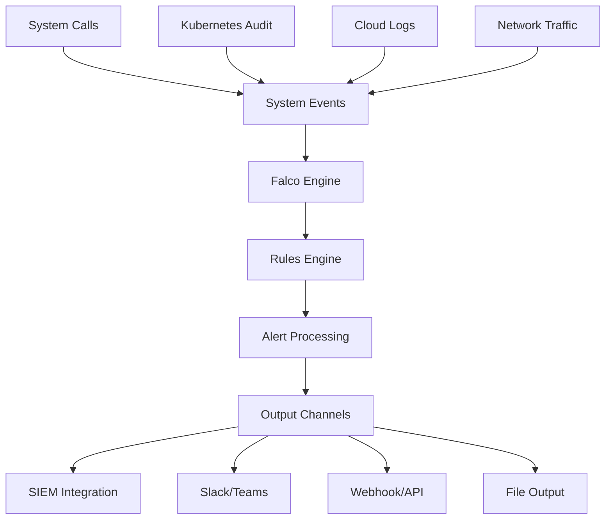

# Falco Mastery: The Complete Guide to Runtime Security in Kubernetes Environments

In today's threat landscape, traditional perimeter security is insufficient for protecting cloud-native environments. Modern attacks target runtime environments directly, exploiting container vulnerabilities, privilege escalation, and lateral movement within Kubernetes clusters. This comprehensive guide explores Falco—the Cloud Native Computing Foundation's runtime security project—providing advanced strategies for implementing enterprise-grade threat detection and response.

Whether you're a security engineer implementing Zero Trust architecture or a platform team securing production workloads, this guide offers the deep expertise needed to master runtime security in Kubernetes environments and advance your career in cloud-native security.

## Understanding the Runtime Security Challenge

### The Modern Threat Landscape

Traditional security models rely on static analysis and perimeter defenses, but cloud-native environments present unique challenges:

```yaml
# Modern Attack Vectors in Kubernetes
Attack Surface Analysis:
  Container Runtime Threats:
    - Privilege escalation attacks
    - Container breakout attempts
    - Malicious process execution
    - Resource abuse and cryptomining
  
  Kubernetes-Specific Threats:
    - Service account abuse
    - Unauthorized API access
    - Network policy bypass
    - Secret and ConfigMap theft
  
  Supply Chain Attacks:
    - Malicious container images
    - Compromised base images
    - Backdoored dependencies
    - Registry poisoning
  
  Insider Threats:
    - Misconfigured privileges
    - Accidental exposure
    - Intentional data exfiltration
    - Policy violations
```

### Why Runtime Security Matters

Static security measures alone cannot protect against sophisticated attacks that exploit legitimate system behavior. Runtime security provides:

- **Real-time threat detection** during actual execution
- **Behavioral analysis** to identify anomalous activities
- **Context-aware alerting** with Kubernetes metadata
- **Forensic capabilities** for incident investigation
- **Compliance automation** for regulatory requirements

## Falco Deep Dive: Architecture and Capabilities

### Core Architecture Components

Falco's architecture provides comprehensive runtime monitoring through multiple layers:



#### Event Sources and Data Collection

```bash
# Falco Event Sources Configuration
falco_event_sources:
  # System call monitoring via eBPF/kernel module
  syscall:
    enabled: true
    driver: "ebpf"  # or "kernel_module"
    buffer_size: "8388608"  # 8MB buffer
    
  # Kubernetes audit events
  k8s_audit:
    enabled: true
    webhook_port: 9765
    max_event_bytes: 1048576
    
  # Cloud provider logs (AWS CloudTrail, etc.)
  cloudtrail:
    enabled: true
    region: "us-west-2"
    
  # Custom plugin sources
  custom_plugins:
    - github.com/falcosecurity/plugins/okta
    - github.com/falcosecurity/plugins/github
```

#### Rules Engine Deep Dive

```yaml
# Advanced Falco Rule Structure
- rule: Suspicious Container Network Activity
  desc: >
    Detect containers attempting to establish suspicious network connections
    that may indicate command and control communication or data exfiltration
  condition: >
    spawned_process and container and
    ((proc.name in (nc, ncat, netcat, wget, curl)) and
     (fd.net and fd.is_server=false) and
     (not fd.sip in (rfc_1918_addresses)))
  output: >
    Suspicious network activity detected
    (user=%user.name command=%proc.cmdline connection=%fd.name
     container_id=%container.id image=%container.image.repository
     k8s_pod=%k8s.pod.name k8s_ns=%k8s.ns.name)
  priority: HIGH
  tags: [network, container, mitre_command_and_control]
  source: syscall
  
- macro: rfc_1918_addresses
  condition: >
    (fd.sip startswith "10." or
     fd.sip startswith "192.168." or
     fd.sip startswith "172.16." or
     fd.sip startswith "172.17." or
     fd.sip startswith "172.18." or
     fd.sip startswith "172.19." or
     fd.sip startswith "172.20." or
     fd.sip startswith "172.21." or
     fd.sip startswith "172.22." or
     fd.sip startswith "172.23." or
     fd.sip startswith "172.24." or
     fd.sip startswith "172.25." or
     fd.sip startswith "172.26." or
     fd.sip startswith "172.27." or
     fd.sip startswith "172.28." or
     fd.sip startswith "172.29." or
     fd.sip startswith "172.30." or
     fd.sip startswith "172.31.")
```

## Enterprise Installation and Configuration

### Production-Grade Deployment

#### Multi-Node Cluster Installation

```bash
# Production Falco installation with custom configuration
cat << 'EOF' > falco-production-values.yaml
# Falco Production Configuration
image:
  repository: falcosecurity/falco-no-driver
  tag: "0.36.2"
  pullPolicy: IfNotPresent

# Resource configuration for production workloads
resources:
  limits:
    cpu: 1000m
    memory: 1Gi
  requests:
    cpu: 100m
    memory: 512Mi

# Enable all event sources
driver:
  enabled: true
  kind: ebpf
  ebpf:
    hostNetwork: true
    path: /root/.falco

# Syscall monitoring configuration
syscall:
  enabled: true
  
# Kubernetes audit integration
k8saudit:
  enabled: true
  
# Configuration for high-volume environments
falco:
  rules_file:
    - /etc/falco/falco_rules.yaml
    - /etc/falco/falco_rules.local.yaml
    - /etc/falco/k8s_audit_rules.yaml
    - /etc/falco/custom_rules.yaml
  
  # Output configuration
  json_output: true
  json_include_output_property: true
  json_include_tags_property: true
  
  # Performance tuning
  syscall_event_drops:
    actions:
      - log
      - alert
    rate: 0.03333
    max_burst: 1000
  
  # File integrity monitoring
  file_output:
    enabled: true
    keep_alive: false
    filename: "/var/log/falco/events.log"
  
  # HTTP output for SIEM integration
  http_output:
    enabled: true
    url: "https://siem.company.com/api/events"
    user_agent: "falco/0.36.2"
    
  # Metrics and monitoring
  metrics:
    enabled: true
    interval: 1h
    output_rule: true
    rules_counters_enabled: true
    resource_utilization_enabled: true

# Custom rules configuration
customRules:
  custom-security-rules.yaml: |-
    # Production security rules
    - macro: production_namespaces
      condition: >
        (k8s.ns.name in (production, prod, live))
    
    - rule: Privileged Container in Production
      desc: Detect privileged containers in production namespaces
      condition: >
        spawned_process and container and
        production_namespaces and
        proc.is_container_healthcheck=false and
        container.privileged=true
      output: >
        Privileged container detected in production
        (user=%user.name command=%proc.cmdline
         container=%container.name image=%container.image.repository
         k8s_pod=%k8s.pod.name k8s_ns=%k8s.ns.name)
      priority: CRITICAL
      tags: [container, privilege-escalation]
    
    - rule: Cryptocurrency Mining Activity
      desc: Detect processes commonly associated with cryptocurrency mining
      condition: >
        spawned_process and container and
        (proc.name in (xmrig, ethminer, cgminer, bfgminer, cpuminer,
                      t-rex, phoenixminer, claymore, nbminer,
                      excavator, nanominer, teamredminer))
      output: >
        Cryptocurrency mining detected
        (user=%user.name command=%proc.cmdline
         container=%container.name k8s_pod=%k8s.pod.name)
      priority: HIGH
      tags: [malware, cryptomining]

# Advanced alerting configuration
falcosidekick:
  enabled: true
  webui:
    enabled: true
  config:
    # Slack integration
    slack:
      webhookurl: "https://hooks.slack.com/services/YOUR/SLACK/WEBHOOK"
      channel: "#security-alerts"
      username: "Falco Security Bot"
      iconurl: "https://falco.org/img/falco.png"
      minimumpriority: "warning"
      messageformat: "long"
    
    # PagerDuty integration for critical alerts
    pagerduty:
      routingkey: "YOUR_PAGERDUTY_INTEGRATION_KEY"
      minimumpriority: "critical"
    
    # SIEM integration
    elasticsearch:
      hostport: "https://elasticsearch.company.com:9200"
      index: "falco-security-events"
      type: "_doc"
      minimumpriority: "notice"
    
    # Webhook for custom integrations
    webhook:
      address: "https://security-automation.company.com/api/webhook"
      minimumpriority: "warning"
      customHeaders:
        Authorization: "Bearer YOUR_API_TOKEN"
        Content-Type: "application/json"

# Node selection and tolerations
nodeSelector:
  security-monitoring: "enabled"

tolerations:
  - effect: NoSchedule
    key: security-dedicated
    operator: Equal
    value: "true"

# Service monitoring
serviceMonitor:
  enabled: true
  additionalLabels:
    monitoring: "prometheus"
  scrapeInterval: 30s
EOF

# Install Falco with production configuration
helm repo add falcosecurity https://falcosecurity.github.io/charts
helm repo update

helm install falco falcosecurity/falco \
  --namespace falco-system \
  --create-namespace \
  --values falco-production-values.yaml
```

#### Kubernetes Audit Log Integration

```bash
# Advanced Kubernetes audit policy for security monitoring
cat << 'EOF' > /etc/kubernetes/audit/security-audit-policy.yaml
apiVersion: audit.k8s.io/v1
kind: Policy
rules:
# Log all security-sensitive operations at Request level
- level: Request
  resources:
  - group: ""
    resources: ["secrets", "serviceaccounts", "nodes"]
  - group: "rbac.authorization.k8s.io"
    resources: ["roles", "rolebindings", "clusterroles", "clusterrolebindings"]
  - group: "security.openshift.io"
    resources: ["securitycontextconstraints"]
  - group: "policy"
    resources: ["podsecuritypolicies"]
  verbs: ["create", "update", "patch", "delete"]
  namespaces: ["kube-system", "kube-public", "falco-system"]

# Log privilege escalation attempts
- level: Request
  resources:
  - group: ""
    resources: ["pods", "pods/exec", "pods/attach", "pods/portforward"]
  verbs: ["create", "update", "patch"]
  omitStages: ["RequestReceived"]

# Log network policy changes
- level: Request
  resources:
  - group: "networking.k8s.io"
    resources: ["networkpolicies"]
  - group: "extensions"
    resources: ["networkpolicies"]
  verbs: ["create", "update", "patch", "delete"]

# Log admission controller webhook configurations
- level: Request
  resources:
  - group: "admissionregistration.k8s.io"
    resources: ["mutatingadmissionconfigurations", "validatingadmissionconfigurations"]
  verbs: ["create", "update", "patch", "delete"]

# Log all failed requests
- level: Request
  namespaceList: ["production", "staging"]
  verbs: ["create", "update", "patch", "delete"]
  resources:
  - group: ""
    resources: ["*"]
  - group: "apps"
    resources: ["*"]
  - group: "extensions"
    resources: ["*"]
  omitStages: ["RequestReceived"]

# Catch-all rule for metadata logging
- level: Metadata
  omitStages: ["RequestReceived"]
EOF

# Update API server configuration
cat << 'EOF' >> /etc/kubernetes/manifests/kube-apiserver.yaml
spec:
  containers:
  - command:
    - kube-apiserver
    # ... existing flags ...
    - --audit-log-path=/var/log/audit/audit.log
    - --audit-log-maxage=30
    - --audit-log-maxbackup=10
    - --audit-log-maxsize=100
    - --audit-policy-file=/etc/kubernetes/audit/security-audit-policy.yaml
    - --audit-webhook-config-file=/etc/kubernetes/audit/webhook-config.yaml
    - --audit-webhook-batch-max-size=1000
    - --audit-webhook-batch-max-wait=5s
    volumeMounts:
    - mountPath: /etc/kubernetes/audit
      name: audit-config
      readOnly: true
    - mountPath: /var/log/audit
      name: audit-logs
  volumes:
  - hostPath:
      path: /etc/kubernetes/audit
      type: DirectoryOrCreate
    name: audit-config
  - hostPath:
      path: /var/log/audit
      type: DirectoryOrCreate
    name: audit-logs
EOF

# Create webhook configuration for Falco
cat << 'EOF' > /etc/kubernetes/audit/webhook-config.yaml
apiVersion: v1
kind: Config
clusters:
- name: falco
  cluster:
    server: http://falco.falco-system.svc.cluster.local:8765/k8s-audit
contexts:
- context:
    cluster: falco
    user: ""
  name: default-context
current-context: default-context
preferences: {}
users: []
EOF
```

## Advanced Rule Development and Customization

### Enterprise Security Rule Patterns

#### MITRE ATT&CK Framework Integration

```yaml
# MITRE ATT&CK-based security rules
customRules:
  mitre-attack-rules.yaml: |-
    # T1055: Process Injection Detection
    - rule: Process Injection Attempt
      desc: >
        Detect potential process injection techniques including
        DLL injection, process hollowing, and thread hijacking
      condition: >
        spawned_process and container and
        ((proc.name in (gdb, strace, ltrace, ptrace)) or
         (proc.cmdline contains "LD_PRELOAD") or
         (proc.cmdline contains "/proc/*/mem") or
         (proc.aname in (gdb, strace, ltrace)) and
         (not proc.pname in (build_tools, debug_containers)))
      output: >
        Potential process injection detected (technique=T1055)
        (user=%user.name command=%proc.cmdline parent=%proc.pname
         container=%container.name k8s_pod=%k8s.pod.name)
      priority: HIGH
      tags: [mitre_defense_evasion, process_injection, T1055]
    
    # T1068: Exploitation for Privilege Escalation
    - rule: Privilege Escalation Exploit Attempt
      desc: >
        Detect common privilege escalation exploit techniques
      condition: >
        spawned_process and container and
        ((proc.name in (dirty-cow, overlayfs, runc-exploit)) or
         (proc.cmdline contains "chmod +s") or
         (proc.cmdline contains "sudo -u#-1") or
         (proc.cmdline contains "/proc/self/exe") or
         (proc.cmdline contains "unshare -rm"))
      output: >
        Privilege escalation exploit attempt (technique=T1068)
        (user=%user.name command=%proc.cmdline
         container=%container.name k8s_pod=%k8s.pod.name)
      priority: CRITICAL
      tags: [mitre_privilege_escalation, exploit, T1068]
    
    # T1190: Exploit Public-Facing Application
    - rule: Web Shell Activity
      desc: >
        Detect potential web shell activity in web server containers
      condition: >
        spawned_process and container and
        k8s.pod.label.app in (nginx, apache, httpd, webapp) and
        ((proc.name in (sh, bash, ash, dash, zsh, fish, csh, tcsh, ksh)) and
         (proc.pname in (nginx, apache2, httpd, php-fpm, tomcat, jetty)) and
         (proc.cmdline contains "whoami" or
          proc.cmdline contains "id" or
          proc.cmdline contains "uname" or
          proc.cmdline contains "netstat" or
          proc.cmdline contains "ps aux" or
          proc.cmdline contains "cat /etc/passwd"))
      output: >
        Web shell activity detected (technique=T1190)
        (user=%user.name command=%proc.cmdline parent=%proc.pname
         container=%container.name k8s_pod=%k8s.pod.name)
      priority: CRITICAL
      tags: [mitre_initial_access, web_shell, T1190]
    
    # T1552: Unsecured Credentials
    - rule: Credential Harvesting Attempt
      desc: >
        Detect attempts to access credential files and environment variables
      condition: >
        ((open_read and fd.name in (/etc/passwd, /etc/shadow, /etc/gshadow,
                                    /root/.ssh/id_rsa, /root/.ssh/id_dsa,
                                    /home/*/.ssh/id_rsa, /home/*/.ssh/id_dsa,
                                    /etc/kubernetes/pki/*, /var/lib/kubelet/pki/*)) or
         (spawned_process and proc.cmdline contains "printenv" and
          proc.cmdline contains "PASSWORD\|TOKEN\|SECRET\|KEY"))
      output: >
        Credential harvesting attempt detected (technique=T1552)
        (user=%user.name file=%fd.name command=%proc.cmdline
         container=%container.name k8s_pod=%k8s.pod.name)
      priority: HIGH
      tags: [mitre_credential_access, credential_harvesting, T1552]

    # Container-specific MITRE techniques
    # T1611: Escape to Host
    - rule: Container Escape Attempt
      desc: >
        Detect attempts to escape container isolation
      condition: >
        spawned_process and container and
        ((proc.cmdline contains "docker.sock") or
         (proc.cmdline contains "/var/run/docker.sock") or
         (proc.cmdline contains "runc") or
         (proc.cmdline contains "cgroups") or
         (proc.cmdline contains "/proc/1/root") or
         (proc.cmdline contains "nsenter") or
         (proc.cmdline contains "unshare") or
         (proc.name in (nsenter, unshare)) or
         (fd.name contains "/proc/*/root"))
      output: >
        Container escape attempt detected (technique=T1611)
        (user=%user.name command=%proc.cmdline
         container=%container.name k8s_pod=%k8s.pod.name)
      priority: CRITICAL
      tags: [mitre_privilege_escalation, container_escape, T1611]
```

#### Compliance-Focused Rules

```yaml
# SOC 2, PCI DSS, and HIPAA compliance rules
customRules:
  compliance-rules.yaml: |-
    # PCI DSS Requirement 7: Restrict access to cardholder data
    - rule: Unauthorized Access to Sensitive Data
      desc: >
        Detect unauthorized access to files that may contain
        cardholder or other sensitive data (PCI DSS 7.1)
      condition: >
        open_read and container and
        (fd.name contains "cardholder" or
         fd.name contains "payment" or
         fd.name contains "credit" or
         fd.name contains "ssn" or
         fd.name contains "pii" or
         fd.name regex ".*\.(?:csv|json|xml|sql)$") and
        not user.name in (authorized_data_users)
      output: >
        Unauthorized sensitive data access (PCI DSS 7.1)
        (user=%user.name file=%fd.name
         container=%container.name k8s_pod=%k8s.pod.name)
      priority: HIGH
      tags: [compliance, pci_dss, sensitive_data]
    
    # SOC 2 Type II - Security and Availability
    - rule: Production System Modification
      desc: >
        Detect unauthorized modifications to production systems
        (SOC 2 - Security and Availability criteria)
      condition: >
        spawned_process and container and
        k8s.ns.name in (production, prod) and
        ((proc.name in (rm, mv, chmod, chown, ln)) or
         (open_write and fd.name in (/etc/*, /usr/bin/*, /usr/sbin/*,
                                     /bin/*, /sbin/*, /lib/*))) and
        not k8s.pod.label.authorized-maintenance = "true"
      output: >
        Unauthorized production system modification (SOC 2)
        (user=%user.name command=%proc.cmdline file=%fd.name
         container=%container.name k8s_pod=%k8s.pod.name)
      priority: HIGH
      tags: [compliance, soc2, production_change]
    
    # HIPAA Security Rule - Technical Safeguards
    - rule: PHI Access Outside Business Hours
      desc: >
        Detect access to PHI outside of normal business hours
        (HIPAA Security Rule 164.312(a))
      condition: >
        open_read and container and
        (fd.name contains "phi" or
         fd.name contains "patient" or
         fd.name contains "medical" or
         k8s.pod.label.data-classification = "phi") and
        (evt.hour < 8 or evt.hour > 18)
      output: >
        PHI access outside business hours (HIPAA 164.312(a))
        (user=%user.name file=%fd.name time=%evt.time
         container=%container.name k8s_pod=%k8s.pod.name)
      priority: WARNING
      tags: [compliance, hipaa, phi_access, after_hours]
    
    # GDPR Article 32 - Security of Processing
    - rule: Personal Data Processing Violation
      desc: >
        Detect unauthorized processing of personal data
        (GDPR Article 32)
      condition: >
        spawned_process and container and
        (proc.cmdline contains "personal_data" or
         proc.cmdline contains "gdpr" or
         k8s.pod.label.data-type = "personal") and
        not k8s.pod.label.gdpr-compliant = "true"
      output: >
        Unauthorized personal data processing (GDPR Art. 32)
        (user=%user.name command=%proc.cmdline
         container=%container.name k8s_pod=%k8s.pod.name)
      priority: HIGH
      tags: [compliance, gdpr, personal_data]
```

### Custom Plugin Development

```go
// Example custom Falco plugin for AWS CloudTrail integration
package main

import (
    "context"
    "encoding/json"
    "github.com/falcosecurity/plugin-sdk-go/pkg/sdk"
    "github.com/falcosecurity/plugin-sdk-go/pkg/sdk/plugins"
    "github.com/falcosecurity/plugin-sdk-go/pkg/sdk/plugins/source"
)

type CloudTrailPlugin struct {
    plugins.BasePlugin
    Config CloudTrailConfig
}

type CloudTrailConfig struct {
    AWSRegion    string `json:"aws_region"`
    S3Bucket     string `json:"s3_bucket"`
    SQSQueueURL  string `json:"sqs_queue_url"`
    RoleARN      string `json:"role_arn"`
}

type CloudTrailEvent struct {
    EventTime     string            `json:"eventTime"`
    EventName     string            `json:"eventName"`
    EventSource   string            `json:"eventSource"`
    UserIdentity  map[string]interface{} `json:"userIdentity"`
    SourceIPAddress string          `json:"sourceIPAddress"`
    Resources     []interface{}     `json:"resources"`
    ErrorCode     string            `json:"errorCode"`
    ErrorMessage  string            `json:"errorMessage"`
}

func (p *CloudTrailPlugin) Info() *plugins.Info {
    return &plugins.Info{
        ID:          "cloudtrail",
        Name:        "AWS CloudTrail",
        Description: "Read AWS CloudTrail logs from S3/SQS",
        Contact:     "support@company.com",
        Version:     "0.1.0",
        EventSource: "aws_cloudtrail",
    }
}

func (p *CloudTrailPlugin) InitSchema() *sdk.SchemaInfo {
    return &sdk.SchemaInfo{
        Schema: `{
            "type": "object",
            "properties": {
                "aws_region": {"type": "string"},
                "s3_bucket": {"type": "string"},
                "sqs_queue_url": {"type": "string"},
                "role_arn": {"type": "string"}
            },
            "required": ["aws_region", "s3_bucket"]
        }`,
    }
}

func (p *CloudTrailPlugin) Init(ctx context.Context, config string) error {
    return json.Unmarshal([]byte(config), &p.Config)
}

func (p *CloudTrailPlugin) Fields() []sdk.FieldEntry {
    return []sdk.FieldEntry{
        {Type: "string", Name: "ct.time", Desc: "CloudTrail event time"},
        {Type: "string", Name: "ct.name", Desc: "CloudTrail event name"},
        {Type: "string", Name: "ct.source", Desc: "CloudTrail event source"},
        {Type: "string", Name: "ct.user", Desc: "CloudTrail user identity"},
        {Type: "string", Name: "ct.sourceip", Desc: "CloudTrail source IP"},
        {Type: "string", Name: "ct.error", Desc: "CloudTrail error code"},
    }
}

// Example Falco rules for CloudTrail events
const cloudTrailRules = `
- rule: Suspicious AWS Root Account Activity
  desc: Detect root account usage which should be avoided
  condition: >
    ct and ct.user contains "root" and
    ct.name in (CreateUser, DeleteUser, AttachUserPolicy, DetachUserPolicy)
  output: >
    Root account used for user management (user=%ct.user event=%ct.name
     source_ip=%ct.sourceip time=%ct.time)
  priority: HIGH
  source: aws_cloudtrail
  tags: [aws, root_account, iam]

- rule: Failed AWS Console Login Attempts
  desc: Detect multiple failed console login attempts
  condition: >
    ct and ct.name = "ConsoleLogin" and ct.error = "Failed authentication"
  output: >
    Failed AWS console login (user=%ct.user source_ip=%ct.sourceip
     time=%ct.time error=%ct.error)
  priority: MEDIUM
  source: aws_cloudtrail
  tags: [aws, authentication, brute_force]
`
```

## Enterprise Alerting and Incident Response

### Advanced Falco Sidekick Configuration

```yaml
# Enterprise alerting configuration
apiVersion: v1
kind: ConfigMap
metadata:
  name: falcosidekick-config
  namespace: falco-system
data:
  config.yaml: |
    # Multi-channel alerting strategy
    slack:
      webhookurl: "https://hooks.slack.com/services/SECURITY/TEAM/WEBHOOK"
      channel: "#security-alerts"
      username: "Falco Security Bot"
      iconurl: "https://falco.org/img/falco.png"
      minimumpriority: "warning"
      messageformat: "long"
      outputformat: "all"
      footer: "https://security.company.com/runbooks"
      
    # PagerDuty for critical incidents
    pagerduty:
      routingkey: "INTEGRATION_KEY"
      minimumpriority: "critical"
      
    # Microsoft Teams for security team
    teams:
      webhookurl: "https://outlook.office.com/webhook/TEAMS_WEBHOOK"
      minimumpriority: "warning"
      activityimage: "https://falco.org/img/falco.png"
      
    # Splunk SIEM integration
    splunk:
      hostport: "splunk.company.com:8088"
      token: "HEC_TOKEN"
      index: "security_events"
      source: "falco"
      sourcetype: "_json"
      minimumpriority: "notice"
      
    # Custom webhook for security orchestration
    webhook:
      address: "https://soar.company.com/api/webhooks/falco"
      customHeaders:
        Authorization: "Bearer SOAR_API_TOKEN"
        X-Event-Source: "falco"
      minimumpriority: "warning"
      
    # File output for audit trail
    influxdb:
      hostport: "influxdb.monitoring.svc.cluster.local:8086"
      database: "security_metrics"
      user: "falco"
      password: "INFLUX_PASSWORD"
      minimumpriority: "notice"
      
    # Prometheus metrics for alerting
    prometheus:
      extralabels: "environment:production,cluster:main"
      
    # AWS CloudWatch for cloud monitoring
    cloudwatchlogs:
      loggroup: "/aws/kubernetes/security/falco"
      logstream: "falco-alerts"
      region: "us-west-2"
      minimumpriority: "warning"
---
# Advanced Falco Sidekick deployment with HA
apiVersion: apps/v1
kind: Deployment
metadata:
  name: falcosidekick
  namespace: falco-system
spec:
  replicas: 3
  selector:
    matchLabels:
      app: falcosidekick
  template:
    metadata:
      labels:
        app: falcosidekick
    spec:
      serviceAccountName: falcosidekick
      affinity:
        podAntiAffinity:
          preferredDuringSchedulingIgnoredDuringExecution:
          - weight: 100
            podAffinityTerm:
              labelSelector:
                matchExpressions:
                - key: app
                  operator: In
                  values:
                  - falcosidekick
              topologyKey: kubernetes.io/hostname
      containers:
      - name: falcosidekick
        image: falcosecurity/falcosidekick:2.27.0
        ports:
        - containerPort: 2801
        env:
        - name: WEBUI_ENABLED
          value: "true"
        - name: WEBUI_RETENTION
          value: "720h"  # 30 days
        volumeMounts:
        - name: config
          mountPath: /etc/falcosidekick/config.yaml
          subPath: config.yaml
        resources:
          limits:
            cpu: 200m
            memory: 256Mi
          requests:
            cpu: 50m
            memory: 128Mi
        livenessProbe:
          httpGet:
            path: /ping
            port: 2801
          initialDelaySeconds: 30
          periodSeconds: 10
        readinessProbe:
          httpGet:
            path: /ping
            port: 2801
          initialDelaySeconds: 5
          periodSeconds: 5
      volumes:
      - name: config
        configMap:
          name: falcosidekick-config
```

### Incident Response Automation

```bash
# Security orchestration and automated response (SOAR) integration
cat << 'EOF' > incident-response-automation.py
#!/usr/bin/env python3
"""
Falco Incident Response Automation
Integrates with security tools for automated threat response
"""

import json
import requests
import subprocess
from datetime import datetime
from typing import Dict, List

class FalcoIncidentHandler:
    def __init__(self, config: Dict):
        self.config = config
        self.severity_mapping = {
            "CRITICAL": 1,
            "HIGH": 2,
            "MEDIUM": 3,
            "LOW": 4
        }
    
    def handle_alert(self, alert: Dict) -> None:
        """Process incoming Falco alert and trigger appropriate response"""
        severity = alert.get("priority", "MEDIUM")
        rule_name = alert.get("rule", "Unknown")
        
        # Create incident ticket
        incident_id = self.create_incident_ticket(alert)
        
        # Trigger automated response based on severity
        if severity == "CRITICAL":
            self.critical_response(alert, incident_id)
        elif severity == "HIGH":
            self.high_severity_response(alert, incident_id)
        else:
            self.standard_response(alert, incident_id)
    
    def critical_response(self, alert: Dict, incident_id: str) -> None:
        """Immediate response for critical threats"""
        pod_name = alert.get("output_fields", {}).get("k8s.pod.name")
        namespace = alert.get("output_fields", {}).get("k8s.ns.name")
        
        if pod_name and namespace:
            # Quarantine the pod
            self.quarantine_pod(pod_name, namespace)
            
            # Alert security team immediately
            self.send_critical_alert(alert, incident_id)
            
            # Collect forensic data
            self.collect_forensics(pod_name, namespace)
    
    def quarantine_pod(self, pod_name: str, namespace: str) -> None:
        """Isolate compromised pod using network policies"""
        quarantine_policy = f"""
apiVersion: networking.k8s.io/v1
kind: NetworkPolicy
metadata:
  name: quarantine-{pod_name}
  namespace: {namespace}
spec:
  podSelector:
    matchLabels:
      quarantine: "true"
  policyTypes:
  - Ingress
  - Egress
  ingress: []
  egress:
  - to: []
    ports:
    - protocol: TCP
      port: 53
    - protocol: UDP
      port: 53
"""
        
        # Label pod for quarantine
        subprocess.run([
            "kubectl", "label", "pod", pod_name,
            f"-n", namespace, "quarantine=true"
        ])
        
        # Apply network policy
        with open(f"/tmp/quarantine-{pod_name}.yaml", "w") as f:
            f.write(quarantine_policy)
        
        subprocess.run([
            "kubectl", "apply", "-f", f"/tmp/quarantine-{pod_name}.yaml"
        ])
    
    def collect_forensics(self, pod_name: str, namespace: str) -> None:
        """Collect forensic data from compromised pod"""
        timestamp = datetime.now().strftime("%Y%m%d-%H%M%S")
        
        # Collect pod logs
        subprocess.run([
            "kubectl", "logs", pod_name, "-n", namespace,
            "--previous", f"> /tmp/forensics-{pod_name}-{timestamp}.log"
        ], shell=True)
        
        # Collect pod description
        subprocess.run([
            "kubectl", "describe", "pod", pod_name, "-n", namespace,
            f"> /tmp/describe-{pod_name}-{timestamp}.yaml"
        ], shell=True)
        
        # Collect network connections
        subprocess.run([
            "kubectl", "exec", pod_name, "-n", namespace, "--",
            "netstat", "-tulpn", f"> /tmp/netstat-{pod_name}-{timestamp}.txt"
        ], shell=True)
        
        # Upload to secure storage
        self.upload_forensics(f"forensics-{pod_name}-{timestamp}")
    
    def create_incident_ticket(self, alert: Dict) -> str:
        """Create incident ticket in ServiceNow/Jira"""
        ticket_data = {
            "summary": f"Security Alert: {alert.get('rule', 'Unknown')}",
            "description": alert.get("output", ""),
            "priority": self.severity_mapping.get(alert.get("priority"), 3),
            "source": "Falco Runtime Security",
            "timestamp": alert.get("time"),
            "labels": ["security", "falco", "kubernetes"]
        }
        
        response = requests.post(
            f"{self.config['ticketing_api']}/incidents",
            json=ticket_data,
            headers={"Authorization": f"Bearer {self.config['api_token']}"}
        )
        
        return response.json().get("incident_id")

# Example webhook endpoint for receiving Falco alerts
from flask import Flask, request, jsonify

app = Flask(__name__)
handler = FalcoIncidentHandler(config={
    "ticketing_api": "https://company.service-now.com/api",
    "api_token": "YOUR_API_TOKEN"
})

@app.route("/api/webhooks/falco", methods=["POST"])
def handle_falco_webhook():
    alert = request.json
    handler.handle_alert(alert)
    return jsonify({"status": "processed", "timestamp": datetime.now().isoformat()})

if __name__ == "__main__":
    app.run(host="0.0.0.0", port=8080)
EOF

chmod +x incident-response-automation.py
```

## Performance Optimization and Troubleshooting

### Performance Tuning for High-Volume Environments

```yaml
# High-performance Falco configuration
apiVersion: v1
kind: ConfigMap
metadata:
  name: falco-performance-config
  namespace: falco-system
data:
  falco.yaml: |
    # Performance-optimized configuration
    system_call_event_drop_threshold: 0.1
    system_call_event_drop_rate: 0.03333
    system_call_event_drop_max_burst: 1000
    
    # Buffer configuration for high throughput
    syscall_event_drops:
      actions:
        - log
        - alert
      rate: 0.03333
      max_burst: 1000
    
    # Optimize rule evaluation
    base_syscalls:
      custom_set:
        - open
        - openat
        - creat
        - execve
        - execveat
        - connect
        - accept
        - clone
        - fork
        - vfork
        - procexit
    
    # Memory optimization
    memory_configuration:
      enabled: true
      max_events_per_sec: 1000
      max_memory_usage_mb: 512
    
    # Output optimization
    buffered_outputs: true
    outputs:
      rate: 1
      max_burst: 1000
    
    # Metadata optimization
    metadata:
      enabled: true
      container_engines:
        - docker
        - containerd
        - cri-o
      kubernetes:
        enabled: true
        api_timeout: 5000ms
        enable_node_filter: true
---
# Resource-optimized DaemonSet
apiVersion: apps/v1
kind: DaemonSet
metadata:
  name: falco-optimized
  namespace: falco-system
spec:
  selector:
    matchLabels:
      app: falco
  template:
    metadata:
      labels:
        app: falco
    spec:
      serviceAccountName: falco
      hostNetwork: true
      hostPID: true
      priorityClassName: system-node-critical
      containers:
      - name: falco
        image: falcosecurity/falco-no-driver:0.36.2
        securityContext:
          privileged: true
        resources:
          limits:
            cpu: 2000m
            memory: 2Gi
          requests:
            cpu: 200m
            memory: 512Mi
        env:
        - name: FALCO_GRPC_ENABLED
          value: "true"
        - name: FALCO_GRPC_BIND_ADDRESS
          value: "unix:///var/run/falco/falco.sock"
        volumeMounts:
        - mountPath: /host/var/run/docker.sock
          name: docker-socket
          readOnly: true
        - mountPath: /host/dev
          name: dev-fs
          readOnly: true
        - mountPath: /host/proc
          name: proc-fs
          readOnly: true
        - mountPath: /host/boot
          name: boot-fs
          readOnly: true
        - mountPath: /host/lib/modules
          name: lib-modules
          readOnly: true
        - mountPath: /host/usr
          name: usr-fs
          readOnly: true
        - mountPath: /host/etc
          name: etc-fs
          readOnly: true
        - mountPath: /var/run/falco
          name: falco-socket-dir
        - mountPath: /etc/falco
          name: falco-config
      volumes:
      - name: docker-socket
        hostPath:
          path: /var/run/docker.sock
      - name: dev-fs
        hostPath:
          path: /dev
      - name: proc-fs
        hostPath:
          path: /proc
      - name: boot-fs
        hostPath:
          path: /boot
      - name: lib-modules
        hostPath:
          path: /lib/modules
      - name: usr-fs
        hostPath:
          path: /usr
      - name: etc-fs
        hostPath:
          path: /etc
      - name: falco-socket-dir
        emptyDir: {}
      - name: falco-config
        configMap:
          name: falco-performance-config
      nodeSelector:
        falco-enabled: "true"
      tolerations:
      - effect: NoSchedule
        key: node-role.kubernetes.io/master
      - effect: NoSchedule
        key: node-role.kubernetes.io/control-plane
```

### Comprehensive Troubleshooting Guide

```bash
# Falco troubleshooting toolkit
cat << 'EOF' > falco-troubleshoot.sh
#!/bin/bash
# Comprehensive Falco troubleshooting script

set -e

echo "=== Falco Troubleshooting Report ==="
echo "Generated: $(date)"
echo

# Check Falco installation
echo "=== Falco Installation Status ==="
kubectl get pods -n falco-system -o wide
echo

echo "=== Falco DaemonSet Status ==="
kubectl describe daemonset falco -n falco-system
echo

# Check Falco configuration
echo "=== Falco Configuration ==="
kubectl get configmap falco -n falco-system -o yaml
echo

# Check Falco logs for errors
echo "=== Recent Falco Logs ==="
kubectl logs -n falco-system -l app=falco --tail=50 --since=1h
echo

# Check driver status
echo "=== Falco Driver Status ==="
kubectl exec -n falco-system ds/falco -- falco --version
kubectl exec -n falco-system ds/falco -- lsmod | grep falco || echo "No kernel module found"
echo

# Check eBPF probe status
echo "=== eBPF Probe Status ==="
kubectl exec -n falco-system ds/falco -- ls -la /root/.falco/ || echo "No eBPF probe directory"
echo

# Check system resources
echo "=== Resource Usage ==="
kubectl top pods -n falco-system
echo

# Check node compatibility
echo "=== Node Kernel Information ==="
kubectl get nodes -o custom-columns=NAME:.metadata.name,KERNEL:.status.nodeInfo.kernelVersion
echo

# Check Kubernetes audit webhook
echo "=== Kubernetes Audit Configuration ==="
kubectl exec -n kube-system $(kubectl get pods -n kube-system | grep kube-apiserver | head -1 | awk '{print $1}') -- cat /etc/kubernetes/manifests/kube-apiserver.yaml | grep -A5 -B5 audit || echo "No audit configuration found"
echo

# Check Falco Sidekick status
echo "=== Falco Sidekick Status ==="
kubectl get pods -n falco-system -l app=falcosidekick
kubectl logs -n falco-system -l app=falcosidekick --tail=20
echo

# Check network connectivity
echo "=== Network Connectivity Tests ==="
kubectl run network-test --image=busybox --rm -it --restart=Never -- nslookup falco.falco-system.svc.cluster.local || echo "DNS resolution failed"
echo

# Performance metrics
echo "=== Performance Metrics ==="
kubectl exec -n falco-system ds/falco -- cat /proc/meminfo | grep -E "(MemTotal|MemFree|MemAvailable)"
kubectl exec -n falco-system ds/falco -- cat /proc/loadavg
echo

# Check for rule compilation errors
echo "=== Rule Compilation Status ==="
kubectl exec -n falco-system ds/falco -- falco --validate || echo "Rule validation failed"
echo

echo "=== Troubleshooting Complete ==="
EOF

chmod +x falco-troubleshoot.sh

# Performance monitoring script
cat << 'EOF' > falco-performance-monitor.sh
#!/bin/bash
# Monitor Falco performance metrics

while true; do
    echo "=== $(date) ==="
    
    # CPU and memory usage
    kubectl top pods -n falco-system
    
    # Event processing rate
    kubectl logs -n falco-system ds/falco --tail=1 | grep -o "Events processed: [0-9]*" || echo "No event stats found"
    
    # Drop statistics
    kubectl logs -n falco-system ds/falco --tail=50 | grep -i "drop" | tail -5
    
    # Alert volume
    kubectl logs -n falco-system ds/falco --since=1m | wc -l
    
    echo "========================"
    sleep 60
done
EOF

chmod +x falco-performance-monitor.sh
```

## Career Development in Cloud-Native Security

### Security Engineer Career Progression

#### Market Demand and Compensation (2025)

```
Cloud-Native Security Professional Salary Ranges:

Entry Level (0-2 years):
- Security Analyst: $70,000 - $95,000
- Cloud Security Associate: $75,000 - $100,000
- DevSecOps Engineer: $80,000 - $105,000

Mid Level (3-5 years):
- Security Engineer: $95,000 - $130,000
- Cloud Security Engineer: $105,000 - $140,000
- Senior DevSecOps Engineer: $115,000 - $150,000

Senior Level (5+ years):
- Principal Security Engineer: $140,000 - $180,000
- Cloud Security Architect: $150,000 - $200,000
- Security Engineering Manager: $135,000 - $175,000

Specialized Roles:
- Incident Response Specialist: $110,000 - $160,000
- Threat Hunter: $120,000 - $170,000
- Compliance Engineer: $100,000 - $145,000

Geographic Premium:
- San Francisco Bay Area: +50-70%
- New York City: +35-55%
- Seattle: +25-45%
- Austin: +15-30%
- Remote positions: +10-20%

Industry Multipliers:
- Financial Services: +25-35%
- Healthcare: +20-30%
- Technology Companies: +30-45%
- Government/Defense: +20-30%
- Consulting: +15-25%
```

### Specialization Paths

#### 1. Runtime Security Specialist

```bash
# Technical skills development roadmap
Core Competencies:
- Runtime security monitoring and threat detection
- Container and Kubernetes security hardening
- Incident response and forensics
- Security automation and orchestration

Advanced Skills:
- eBPF programming for custom security monitoring
- Kernel-level security mechanisms
- Advanced threat hunting techniques
- Security tool development and integration

Certification Path:
- Certified Kubernetes Security Specialist (CKS)
- GIAC Cloud Security Automation (GCSA)
- AWS Certified Security - Specialty
- CISSP or similar security certification
```

#### 2. DevSecOps Engineer

```yaml
# DevSecOps specialization focus
Security Integration:
- CI/CD pipeline security
- Infrastructure as Code security
- Automated security testing
- Policy as Code implementation

Tool Expertise:
- Falco for runtime security
- Open Policy Agent (OPA) for policy enforcement
- Twistlock/Prisma Cloud for container security
- Aqua Security or Sysdig for comprehensive protection

Platform Skills:
- Multi-cloud security (AWS, Azure, GCP)
- Service mesh security (Istio, Linkerd)
- GitOps security (ArgoCD, Flux)
- Monitoring and observability (Prometheus, Grafana)
```

#### 3. Compliance and Risk Management

```bash
# Compliance specialization areas
Regulatory Frameworks:
- SOC 2 Type II compliance
- PCI DSS for payment processing
- HIPAA for healthcare
- GDPR for data protection
- FedRAMP for government

Technical Implementation:
- Automated compliance monitoring
- Policy enforcement automation
- Audit trail management
- Risk assessment methodologies
- Continuous compliance validation
```

### Building a Security Portfolio

#### 1. Practical Projects

```yaml
# Portfolio project examples
Runtime Security Lab:
  Description: "Multi-tier application with comprehensive security monitoring"
  Components:
    - Falco deployment with custom rules
    - Simulated attack scenarios
    - Incident response automation
    - Compliance reporting dashboard
  Technologies: [Kubernetes, Falco, Prometheus, Grafana, ELK Stack]

Threat Detection System:
  Description: "Machine learning-enhanced threat detection"
  Components:
    - Custom Falco plugins
    - ML-based anomaly detection
    - Automated response workflows
    - Integration with SOAR platforms
  Technologies: [Python, TensorFlow, Falco, Kafka, Elasticsearch]

Compliance Automation:
  Description: "Automated compliance validation and reporting"
  Components:
    - Policy as Code implementation
    - Continuous compliance monitoring
    - Automated remediation
    - Executive dashboards
  Technologies: [OPA, Falco, Terraform, Ansible, Splunk]
```

#### 2. Community Contribution

```bash
# Ways to contribute to the security community
Open Source Contributions:
git clone https://github.com/falcosecurity/falco
git clone https://github.com/falcosecurity/falcosidekick
git clone https://github.com/falcosecurity/event-generator

# Focus areas for contributions:
# - Custom rule development
# - Plugin development
# - Documentation improvements
# - Performance optimizations
# - Integration examples

Content Creation:
- Security blog posts and tutorials
- Conference presentations
- Workshop development
- Webinar participation
- Podcast appearances

Community Leadership:
- Local security meetups
- OWASP chapter leadership
- Kubernetes security SIG participation
- Mentoring junior security professionals
```

## Conclusion: Mastering Cloud-Native Security

Falco represents a paradigm shift in how organizations approach runtime security in cloud-native environments. By providing real-time threat detection, comprehensive behavioral analysis, and flexible alerting mechanisms, Falco enables security teams to move from reactive to proactive security postures.

### Key Success Principles

**Technical Mastery:**
- Deep understanding of container and Kubernetes security models
- Proficiency in rule development and customization
- Expertise in integrating security tools and workflows
- Automation mindset for scalable security operations

**Operational Excellence:**
- Incident response automation and orchestration
- Performance optimization for production environments
- Compliance automation and continuous monitoring
- Cross-functional collaboration with development teams

**Career Development:**
- Specialization in high-demand security domains
- Contribution to open-source security projects
- Building practical security portfolios
- Developing expertise in emerging technologies

### Future Outlook

The cloud-native security landscape continues to evolve rapidly, with new threats and opportunities emerging regularly. Key trends include:

1. **AI/ML Integration**: Enhanced threat detection through machine learning
2. **Zero Trust Architecture**: Runtime security as a core component
3. **Compliance Automation**: Continuous compliance validation and reporting
4. **Edge Security**: Extending runtime security to edge computing environments
5. **Supply Chain Security**: Runtime verification of software integrity

### Next Steps

1. **Immediate**: Deploy Falco in development environments and create custom rules
2. **Short-term**: Implement production runtime security monitoring with automated alerting
3. **Medium-term**: Develop expertise in security automation and incident response
4. **Long-term**: Become a subject matter expert in cloud-native security architecture

The demand for cloud-native security expertise continues to grow exponentially, creating unprecedented opportunities for skilled professionals. With Falco mastery and the comprehensive knowledge from this guide, you'll be positioned to lead security initiatives, architect resilient systems, and advance your career in this critical field.

Remember: effective security is not about preventing all attacks—it's about detecting them quickly, responding effectively, and continuously improving your security posture through learned experience.

## Additional Resources

- [Falco Official Documentation](https://falco.org/docs/)
- [CNCF Security SIG](https://github.com/cncf/sig-security)
- [Kubernetes Security Best Practices](https://kubernetes.io/docs/concepts/security/)
- [NIST Cybersecurity Framework](https://www.nist.gov/cyberframework)
- [OWASP Kubernetes Security Cheat Sheet](https://cheatsheetseries.owasp.org/cheatsheets/Kubernetes_Security_Cheat_Sheet.html)
- [Falco Community](https://github.com/falcosecurity/community)