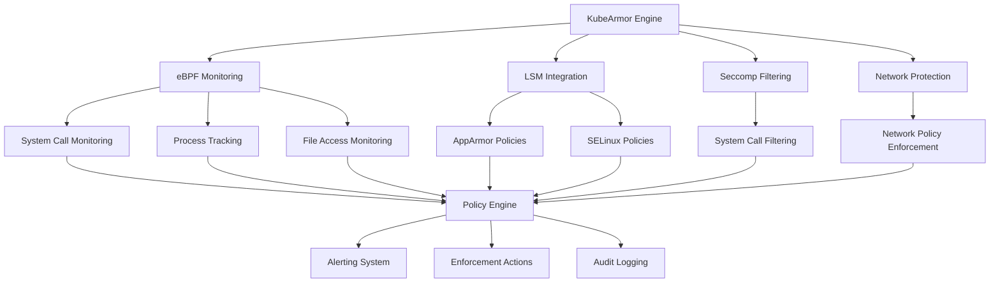

# KubeArmor Mastery: The Complete Guide to Cloud-Native Runtime Security and Policy Enforcement in Kubernetes

In the rapidly evolving cloud-native landscape, traditional perimeter security is insufficient to protect containerized workloads from sophisticated runtime attacks. Modern threats require intelligent, real-time protection that understands application behavior and enforces granular security policies at the kernel level. This comprehensive guide explores KubeArmor—the CNCF sandbox project revolutionizing runtime security—providing advanced strategies for implementing enterprise-grade protection in Kubernetes environments.

Whether you're a security architect designing Zero Trust systems or a platform engineer securing production workloads, this guide offers the deep expertise needed to master cloud-native runtime security and advance your career in this critical field.

## Understanding Cloud-Native Runtime Security

### The Evolution of Container Security

Traditional security models were designed for static, perimeter-based infrastructures. Cloud-native environments present fundamentally different challenges:

```yaml
# Modern Cloud-Native Security Challenges
Runtime Threats:
  Process-Level Attacks:
    - Container escape attempts
    - Privilege escalation exploits
    - Malicious process injection
    - Runtime code execution
  
  Network-Based Threats:
    - Lateral movement attacks
    - Command and control communication
    - Data exfiltration attempts
    - Service mesh manipulation
  
  File System Attacks:
    - Configuration tampering
    - Binary replacement
    - Log manipulation
    - Secret theft
  
  System-Level Exploits:
    - Kernel vulnerabilities
    - System call abuse
    - Resource exhaustion
    - Capability escalation

Traditional Security Limitations:
  Static Analysis:
    - Cannot detect runtime behavior
    - Limited context awareness
    - No dynamic threat response
    - Ineffective against zero-day attacks
  
  Perimeter-Based Controls:
    - Inadequate for east-west traffic
    - Cannot inspect encrypted communications
    - Limited application context
    - Bypassed by compromised containers
```

### KubeArmor: Next-Generation Runtime Protection

KubeArmor addresses these limitations by providing comprehensive runtime security that combines multiple Linux security technologies with Kubernetes-native policy management:



#### Core Architecture Components

```go
// Simplified KubeArmor architecture overview
type KubeArmorEngine struct {
    // eBPF-based monitoring
    eBPFManager     *ebpf.Manager
    SystemCallTracer *syscall.Tracer
    ProcessMonitor  *process.Monitor
    FileSystemWatcher *fs.Watcher
    NetworkMonitor  *network.Monitor
    
    // Linux Security Module integration
    LSMManager      *lsm.Manager
    AppArmorHandler *apparmor.Handler
    SELinuxHandler  *selinux.Handler
    
    // Policy management
    PolicyEngine    *policy.Engine
    PolicyValidator *policy.Validator
    PolicyEnforcer  *policy.Enforcer
    
    // Kubernetes integration
    K8sClient       kubernetes.Interface
    K8sWatcher      *k8s.ResourceWatcher
    
    // Observability
    MetricsCollector *metrics.Collector
    AlertManager    *alert.Manager
    AuditLogger     *audit.Logger
}

// Policy enforcement decision engine
func (ka *KubeArmorEngine) EvaluateEvent(event *SecurityEvent) EnforcementAction {
    // Collect context from multiple sources
    context := ka.buildEventContext(event)
    
    // Apply security policies
    for _, policy := range ka.PolicyEngine.GetApplicablePolicies(context) {
        decision := policy.Evaluate(event, context)
        
        switch decision.Action {
        case policy.BLOCK:
            ka.logSecurityViolation(event, policy, decision)
            return EnforcementAction{Type: DENY, Reason: decision.Reason}
        case policy.ALERT:
            ka.AlertManager.SendAlert(event, policy, decision)
        case policy.AUDIT:
            ka.AuditLogger.LogEvent(event, policy, decision)
        }
    }
    
    return EnforcementAction{Type: ALLOW}
}
```

## Advanced KubeArmor Architecture and Integration

### Enterprise-Grade Deployment

#### High-Availability Installation

```yaml
# Production KubeArmor deployment with HA configuration
apiVersion: v1
kind: Namespace
metadata:
  name: kubearmor-system
  labels:
    name: kubearmor-system
    security.kubearmor.com/managed: "true"
---
# KubeArmor Controller (HA)
apiVersion: apps/v1
kind: Deployment
metadata:
  name: kubearmor-controller
  namespace: kubearmor-system
spec:
  replicas: 3
  selector:
    matchLabels:
      app: kubearmor-controller
  template:
    metadata:
      labels:
        app: kubearmor-controller
    spec:
      serviceAccountName: kubearmor-controller
      affinity:
        podAntiAffinity:
          preferredDuringSchedulingIgnoredDuringExecution:
          - weight: 100
            podAffinityTerm:
              labelSelector:
                matchExpressions:
                - key: app
                  operator: In
                  values:
                  - kubearmor-controller
              topologyKey: kubernetes.io/hostname
      containers:
      - name: controller
        image: kubearmor/kubearmor-controller:v1.1.0
        ports:
        - containerPort: 8443
          name: webhook
        - containerPort: 8080
          name: metrics
        env:
        - name: ENABLE_WEBHOOK
          value: "true"
        - name: WEBHOOK_PORT
          value: "8443"
        - name: METRICS_PORT
          value: "8080"
        - name: LOG_LEVEL
          value: "info"
        resources:
          requests:
            cpu: 100m
            memory: 128Mi
          limits:
            cpu: 500m
            memory: 512Mi
        securityContext:
          allowPrivilegeEscalation: false
          readOnlyRootFilesystem: true
          runAsNonRoot: true
          runAsUser: 1000
          capabilities:
            drop:
            - ALL
        volumeMounts:
        - name: webhook-certs
          mountPath: /tmp/k8s-webhook-server/serving-certs
          readOnly: true
        - name: tmp
          mountPath: /tmp
        livenessProbe:
          httpGet:
            path: /healthz
            port: 8080
          initialDelaySeconds: 30
          periodSeconds: 10
        readinessProbe:
          httpGet:
            path: /readyz
            port: 8080
          initialDelaySeconds: 5
          periodSeconds: 5
      volumes:
      - name: webhook-certs
        secret:
          secretName: kubearmor-webhook-certs
      - name: tmp
        emptyDir: {}
---
# KubeArmor Agent (DaemonSet)
apiVersion: apps/v1
kind: DaemonSet
metadata:
  name: kubearmor-agent
  namespace: kubearmor-system
spec:
  selector:
    matchLabels:
      app: kubearmor-agent
  template:
    metadata:
      labels:
        app: kubearmor-agent
    spec:
      serviceAccountName: kubearmor-agent
      hostPID: true
      hostNetwork: true
      dnsPolicy: ClusterFirstWithHostNet
      containers:
      - name: kubearmor
        image: kubearmor/kubearmor:v1.1.0
        ports:
        - containerPort: 32767
          name: grpc
        env:
        - name: KUBEARMOR_NODENAME
          valueFrom:
            fieldRef:
              fieldPath: spec.nodeName
        - name: KUBEARMOR_NAMESPACE
          valueFrom:
            fieldRef:
              fieldPath: metadata.namespace
        securityContext:
          privileged: true
        resources:
          requests:
            cpu: 100m
            memory: 256Mi
          limits:
            cpu: 1000m
            memory: 1Gi
        volumeMounts:
        - name: host-proc
          mountPath: /host/proc
          readOnly: true
        - name: host-sys
          mountPath: /host/sys
          readOnly: true
        - name: host-etc
          mountPath: /host/etc
          readOnly: true
        - name: host-var-log
          mountPath: /host/var/log
          readOnly: true
        - name: host-lib-modules
          mountPath: /host/lib/modules
          readOnly: true
        - name: host-usr-src
          mountPath: /host/usr/src
          readOnly: true
        - name: host-run
          mountPath: /host/run
        - name: usr-src
          mountPath: /usr/src
        - name: lib-modules
          mountPath: /lib/modules
        - name: host-boot
          mountPath: /host/boot
          readOnly: true
        livenessProbe:
          exec:
            command:
            - /bin/bash
            - -c
            - karmor probe
          initialDelaySeconds: 60
          periodSeconds: 10
        readinessProbe:
          exec:
            command:
            - /bin/bash
            - -c
            - karmor probe
          initialDelaySeconds: 30
          periodSeconds: 5
      volumes:
      - name: host-proc
        hostPath:
          path: /proc
      - name: host-sys
        hostPath:
          path: /sys
      - name: host-etc
        hostPath:
          path: /etc
      - name: host-var-log
        hostPath:
          path: /var/log
      - name: host-lib-modules
        hostPath:
          path: /lib/modules
      - name: host-usr-src
        hostPath:
          path: /usr/src
      - name: host-run
        hostPath:
          path: /run
      - name: usr-src
        hostPath:
          path: /usr/src
      - name: lib-modules
        hostPath:
          path: /lib/modules
      - name: host-boot
        hostPath:
          path: /boot
      tolerations:
      - effect: NoSchedule
        key: node-role.kubernetes.io/master
      - effect: NoSchedule
        key: node-role.kubernetes.io/control-plane
      - effect: NoSchedule
        key: CriticalAddonsOnly
        operator: Exists
      - effect: NoExecute
        key: node.kubernetes.io/not-ready
        operator: Exists
      - effect: NoExecute
        key: node.kubernetes.io/unreachable
        operator: Exists
---
# Service for KubeArmor metrics
apiVersion: v1
kind: Service
metadata:
  name: kubearmor-controller-metrics
  namespace: kubearmor-system
spec:
  selector:
    app: kubearmor-controller
  ports:
  - name: metrics
    port: 8080
    targetPort: 8080
  type: ClusterIP
---
# ServiceMonitor for Prometheus
apiVersion: monitoring.coreos.com/v1
kind: ServiceMonitor
metadata:
  name: kubearmor-controller
  namespace: kubearmor-system
  labels:
    app: kubearmor-controller
spec:
  selector:
    matchLabels:
      app: kubearmor-controller
  endpoints:
  - port: metrics
    interval: 30s
    path: /metrics
```

#### Advanced Configuration Management

```yaml
# KubeArmor configuration for enterprise environments
apiVersion: v1
kind: ConfigMap
metadata:
  name: kubearmor-config
  namespace: kubearmor-system
data:
  config.yaml: |
    # KubeArmor Global Configuration
    global:
      # Cluster identification
      cluster_name: "production-cluster"
      environment: "production"
      
      # Performance settings
      max_events_per_second: 10000
      event_buffer_size: 100000
      
      # Security settings
      default_action: "block"
      enable_zero_trust: true
      
      # Audit settings
      audit_enabled: true
      audit_level: "detailed"
      audit_retention_days: 90
    
    # eBPF configuration
    ebpf:
      enabled: true
      # BPF programs to load
      programs:
        - "process_monitor"
        - "file_monitor"
        - "network_monitor"
        - "capability_monitor"
      
      # Performance tuning
      ring_buffer_size: 64
      max_entries: 100000
      
      # Event filtering
      syscall_filter:
        - "execve"
        - "execveat"
        - "openat"
        - "connect"
        - "sendto"
    
    # LSM (Linux Security Module) configuration
    lsm:
      # Preferred LSM (apparmor, selinux, bpf)
      preferred: "apparmor"
      
      # Enforcement modes
      apparmor:
        enabled: true
        default_mode: "enforce"
        profile_loading: "automatic"
      
      selinux:
        enabled: false
        default_mode: "enforcing"
      
      bpf:
        enabled: true
        pinned_maps: true
    
    # Network security
    network:
      # Network policy enforcement
      enforce_network_policies: true
      
      # DNS monitoring
      dns_monitoring: true
      allowed_dns_servers:
        - "10.96.0.10"  # kube-dns
        - "8.8.8.8"     # Google DNS
        - "1.1.1.1"     # Cloudflare DNS
      
      # Egress control
      default_egress_action: "block"
      allowed_egress_ports:
        - 53   # DNS
        - 80   # HTTP
        - 443  # HTTPS
    
    # File system protection
    filesystem:
      # Critical path protection
      protected_paths:
        - "/etc/passwd"
        - "/etc/shadow"
        - "/etc/kubernetes"
        - "/var/lib/etcd"
        - "/etc/ssl/private"
      
      # Immutable directories
      immutable_paths:
        - "/usr/bin"
        - "/usr/sbin"
        - "/bin"
        - "/sbin"
      
      # File integrity monitoring
      fim_enabled: true
      fim_paths:
        - "/etc"
        - "/opt/app/config"
    
    # Process security
    process:
      # Dangerous executables
      blocked_executables:
        - "/usr/bin/curl"
        - "/usr/bin/wget"
        - "/bin/nc"
        - "/usr/bin/ssh"
        - "/usr/bin/scp"
      
      # Allowed process trees
      allowed_parent_processes:
        - "/usr/bin/python3"
        - "/usr/bin/node"
        - "/usr/bin/java"
        - "/usr/sbin/nginx"
    
    # Observability
    observability:
      # Metrics
      metrics_enabled: true
      metrics_port: 8080
      
      # Logging
      log_level: "info"
      log_format: "json"
      
      # Alerts
      alerting:
        enabled: true
        webhook_url: "https://alerts.company.com/webhook"
        severity_threshold: "medium"
        
        # Alert rate limiting
        rate_limit:
          enabled: true
          max_alerts_per_minute: 100
          burst_size: 200
    
    # Integration settings
    integrations:
      # Falco integration
      falco:
        enabled: true
        endpoint: "falco.falco-system.svc.cluster.local:8765"
      
      # OPA integration
      opa:
        enabled: true
        endpoint: "opa.opa-system.svc.cluster.local:8181"
      
      # SIEM integration
      siem:
        enabled: true
        type: "elasticsearch"
        endpoint: "https://elasticsearch.security.svc.cluster.local:9200"
        index_prefix: "kubearmor-"
```

## Advanced Policy Development and Management

### Comprehensive Security Policy Framework

#### Zero Trust Policy Templates

```yaml
# Zero Trust KubeArmor policy collection
apiVersion: v1
kind: ConfigMap
metadata:
  name: zero-trust-policies
  namespace: kubearmor-system
data:
  # High-security web application policy
  webapp-zero-trust.yaml: |
    apiVersion: security.kubearmor.com/v1
    kind: KubeArmorPolicy
    metadata:
      name: webapp-zero-trust
      namespace: production
    spec:
      tags: ["zero-trust", "web-application", "production"]
      message: "Zero Trust policy violation detected"
      
      selector:
        matchLabels:
          app: webapp
          tier: frontend
          environment: production
      
      # Process restrictions - Zero Trust approach
      process:
        matchPaths:
        # Block dangerous executables
        - path: /bin/bash
          action: Block
        - path: /bin/sh
          action: Block
        - path: /usr/bin/curl
          action: Block
        - path: /usr/bin/wget
          action: Block
        - path: /bin/nc
          action: Block
        - path: /usr/bin/ssh
          action: Block
        
        # Allow only application-specific processes
        - path: /usr/sbin/nginx
          action: Allow
        - path: /usr/bin/python3
          action: Allow
          fromSource:
          - path: /usr/sbin/nginx
        
        # Block process injection attempts
        matchDirectories:
        - dir: /proc/*/mem
          action: Block
          recursive: false
        - dir: /proc/*/environ
          action: Block
          recursive: false
      
      # File system restrictions
      file:
        matchPaths:
        # Block access to sensitive system files
        - path: /etc/passwd
          action: Block
        - path: /etc/shadow
          action: Block
        - path: /etc/sudoers
          action: Block
        - path: /root/
          action: Block
          recursive: true
        
        # Block write access to system directories
        - path: /usr/
          action: Block
          recursive: true
          ownerOnly: false
          fromSource:
          - path: /usr/sbin/nginx
            action: Block
        
        # Allow specific application files
        - path: /var/log/nginx/
          action: Allow
          recursive: true
          ownerOnly: true
        - path: /var/www/
          action: Allow
          recursive: true
          readOnly: true
        - path: /etc/nginx/
          action: Allow
          recursive: true
          readOnly: true
        
        # Block temporary file misuse
        matchDirectories:
        - dir: /tmp
          action: Audit
          recursive: false
          fromSource:
          - path: /usr/sbin/nginx
      
      # Network restrictions
      network:
        matchProtocols:
        # Block raw sockets
        - protocol: raw
          action: Block
        - protocol: packet
          action: Block
        
        # Allow only necessary protocols
        - protocol: tcp
          action: Allow
          fromSource:
          - path: /usr/sbin/nginx
        - protocol: udp
          action: Allow
          fromSource:
          - path: /usr/sbin/nginx
      
      # Capability restrictions
      capabilities:
        matchCapabilities:
        # Block dangerous capabilities
        - capability: SYS_ADMIN
          action: Block
        - capability: SYS_PTRACE
          action: Block
        - capability: SYS_MODULE
          action: Block
        - capability: NET_RAW
          action: Block
        - capability: DAC_OVERRIDE
          action: Block
        
        # Allow minimal required capabilities
        - capability: NET_BIND_SERVICE
          action: Allow
          fromSource:
          - path: /usr/sbin/nginx
  
  # Database security policy
  database-security.yaml: |
    apiVersion: security.kubearmor.com/v1
    kind: KubeArmorPolicy
    metadata:
      name: database-security
      namespace: production
    spec:
      tags: ["database", "data-protection", "compliance"]
      message: "Database security violation"
      
      selector:
        matchLabels:
          app: postgresql
          tier: database
      
      process:
        matchPaths:
        # Only allow database executables
        - path: /usr/lib/postgresql/*/bin/postgres
          action: Allow
        - path: /usr/bin/pg_*
          action: Allow
        
        # Block system utilities
        - path: /bin/bash
          action: Block
        - path: /bin/sh
          action: Block
        - path: /usr/bin/curl
          action: Block
        - path: /usr/bin/wget
          action: Block
      
      file:
        matchPaths:
        # Protect database files
        - path: /var/lib/postgresql/data/
          action: Allow
          recursive: true
          ownerOnly: true
          fromSource:
          - path: /usr/lib/postgresql/*/bin/postgres
        
        # Block access to sensitive files
        - path: /etc/passwd
          action: Block
        - path: /etc/shadow
          action: Block
        
        # Configuration files (read-only)
        - path: /etc/postgresql/
          action: Allow
          recursive: true
          readOnly: true
        
        # Log files
        - path: /var/log/postgresql/
          action: Allow
          recursive: true
          ownerOnly: true
      
      network:
        matchProtocols:
        # Allow database connections
        - protocol: tcp
          action: Allow
          fromSource:
          - path: /usr/lib/postgresql/*/bin/postgres
        
        # Block other protocols
        - protocol: raw
          action: Block
        - protocol: packet
          action: Block
  
  # Microservice API policy
  microservice-api.yaml: |
    apiVersion: security.kubearmor.com/v1
    kind: KubeArmorPolicy
    metadata:
      name: microservice-api
      namespace: production
    spec:
      tags: ["microservice", "api", "zero-trust"]
      message: "Microservice security violation"
      
      selector:
        matchLabels:
          app: api-service
          type: microservice
      
      process:
        matchPaths:
        # Allow application runtime
        - path: /usr/bin/node
          action: Allow
        - path: /usr/bin/python3
          action: Allow
        - path: /usr/bin/java
          action: Allow
        
        # Block shell access
        - path: /bin/bash
          action: Block
        - path: /bin/sh
          action: Block
        
        # Block network utilities
        - path: /usr/bin/curl
          action: Block
        - path: /usr/bin/wget
          action: Block
        - path: /bin/nc
          action: Block
      
      file:
        matchPaths:
        # Application code (read-only)
        - path: /app/
          action: Allow
          recursive: true
          readOnly: true
        
        # Configuration files
        - path: /etc/app/
          action: Allow
          recursive: true
          readOnly: true
        
        # Temporary files (restricted)
        - path: /tmp/app-*
          action: Allow
          ownerOnly: true
        
        # Block system modification
        - path: /etc/passwd
          action: Block
        - path: /etc/shadow
          action: Block
        - path: /usr/
          action: Block
          recursive: true
          ownerOnly: false
      
      network:
        matchProtocols:
        # API communication
        - protocol: tcp
          action: Allow
          fromSource:
          - path: /usr/bin/node
          - path: /usr/bin/python3
          - path: /usr/bin/java
        
        # DNS resolution
        - protocol: udp
          action: Allow
          fromSource:
          - path: /usr/bin/node
          - path: /usr/bin/python3
          - path: /usr/bin/java
```

#### Advanced Threat Detection Policies

```yaml
# Advanced threat detection and response policies
apiVersion: v1
kind: ConfigMap
metadata:
  name: threat-detection-policies
  namespace: kubearmor-system
data:
  # Container escape detection
  container-escape-detection.yaml: |
    apiVersion: security.kubearmor.com/v1
    kind: KubeArmorPolicy
    metadata:
      name: container-escape-detection
      namespace: kube-system
    spec:
      tags: ["container-escape", "critical-threat", "incident-response"]
      message: "Container escape attempt detected"
      severity: 10
      
      selector:
        matchLabels: {}  # Apply to all pods
      
      process:
        matchPaths:
        # Docker socket access
        - path: /var/run/docker.sock
          action: Block
        
        # Container runtime manipulation
        - path: /usr/bin/docker
          action: Block
        - path: /usr/bin/runc
          action: Block
        - path: /usr/bin/containerd
          action: Block
        
        # Namespace manipulation
        - path: /usr/bin/nsenter
          action: Block
        - path: /usr/bin/unshare
          action: Block
        
        # Privilege escalation tools
        - path: /usr/bin/sudo
          action: Block
        - path: /bin/su
          action: Block
      
      file:
        matchPaths:
        # Host filesystem access
        - path: /proc/1/root
          action: Block
          recursive: true
        
        # Container runtime sockets
        - path: /var/run/docker.sock
          action: Block
        - path: /var/run/containerd/containerd.sock
          action: Block
        
        # Host proc filesystem
        - path: /proc/*/root
          action: Block
        - path: /proc/*/cwd
          action: Block
        
        # Host network namespace
        - path: /proc/1/ns/net
          action: Block
        - path: /proc/1/ns/pid
          action: Block
        - path: /proc/1/ns/mnt
          action: Block
      
      capabilities:
        matchCapabilities:
        # Dangerous capabilities for container escape
        - capability: SYS_ADMIN
          action: Block
        - capability: SYS_PTRACE
          action: Block
        - capability: SYS_MODULE
          action: Block
        - capability: DAC_READ_SEARCH
          action: Block
        - capability: DAC_OVERRIDE
          action: Audit
  
  # Cryptocurrency mining detection
  cryptomining-detection.yaml: |
    apiVersion: security.kubearmor.com/v1
    kind: KubeArmorPolicy
    metadata:
      name: cryptomining-detection
      namespace: default
    spec:
      tags: ["cryptomining", "malware", "resource-abuse"]
      message: "Cryptocurrency mining activity detected"
      severity: 8
      
      selector:
        matchLabels: {}
      
      process:
        matchPaths:
        # Known mining software
        - path: /usr/bin/xmrig
          action: Block
        - path: /usr/bin/ethminer
          action: Block
        - path: /usr/bin/cgminer
          action: Block
        - path: /usr/bin/bfgminer
          action: Block
        - path: /usr/bin/cpuminer
          action: Block
        - path: /tmp/xmrig
          action: Block
        - path: /tmp/miner
          action: Block
        
        # Suspicious process patterns
        matchDirectories:
        - dir: /tmp
          action: Audit
          recursive: false
        
        # Monitor for mining-related arguments
        matchPatterns:
        - pattern: "*stratum*"
          action: Block
        - pattern: "*mining*pool*"
          action: Block
        - pattern: "*--donate-level*"
          action: Block
      
      network:
        matchProtocols:
        # Mining pool communication
        - protocol: tcp
          action: Audit
          fromSource:
          - path: /tmp/*
          - path: /usr/bin/*miner*
  
  # Privilege escalation detection
  privilege-escalation-detection.yaml: |
    apiVersion: security.kubearmor.com/v1
    kind: KubeArmorPolicy
    metadata:
      name: privilege-escalation-detection
      namespace: default
    spec:
      tags: ["privilege-escalation", "exploit", "security-violation"]
      message: "Privilege escalation attempt detected"
      severity: 9
      
      selector:
        matchLabels: {}
      
      process:
        matchPaths:
        # SUID/SGID exploitation
        - path: /usr/bin/sudo
          action: Audit
        - path: /bin/su
          action: Audit
        - path: /usr/bin/passwd
          action: Audit
        
        # Known exploit tools
        - path: /tmp/exploit
          action: Block
        - path: /tmp/privesc
          action: Block
        - path: /tmp/dirty*
          action: Block
        
        # Capability manipulation
        - path: /usr/bin/setcap
          action: Block
        - path: /usr/bin/getcap
          action: Audit
      
      file:
        matchPaths:
        # Shadow file access
        - path: /etc/shadow
          action: Audit
        - path: /etc/passwd
          action: Audit
        
        # Sudoers manipulation
        - path: /etc/sudoers
          action: Block
        - path: /etc/sudoers.d/
          action: Block
          recursive: true
        
        # Cron job manipulation
        - path: /etc/crontab
          action: Block
        - path: /var/spool/cron/
          action: Block
          recursive: true
      
      capabilities:
        matchCapabilities:
        - capability: SETUID
          action: Audit
        - capability: SETGID
          action: Audit
        - capability: DAC_OVERRIDE
          action: Audit
        - capability: FOWNER
          action: Audit
```

### Policy Automation and Management

#### GitOps-Based Policy Management

```yaml
# GitOps workflow for KubeArmor policy management
apiVersion: v1
kind: ConfigMap
metadata:
  name: policy-automation
  namespace: kubearmor-system
data:
  policy-sync.sh: |
    #!/bin/bash
    # Automated policy synchronization from Git repository
    
    set -euo pipefail
    
    POLICY_REPO="${POLICY_REPO:-https://github.com/company/kubearmor-policies.git}"
    POLICY_BRANCH="${POLICY_BRANCH:-main}"
    POLICY_DIR="/tmp/kubearmor-policies"
    NAMESPACE="${NAMESPACE:-default}"
    
    echo "=== KubeArmor Policy Sync ==="
    echo "Repository: $POLICY_REPO"
    echo "Branch: $POLICY_BRANCH"
    echo "Namespace: $NAMESPACE"
    
    # Clone or update policy repository
    if [ -d "$POLICY_DIR" ]; then
        cd "$POLICY_DIR"
        git pull origin "$POLICY_BRANCH"
    else
        git clone -b "$POLICY_BRANCH" "$POLICY_REPO" "$POLICY_DIR"
        cd "$POLICY_DIR"
    fi
    
    # Validate policies before applying
    echo "Validating policies..."
    for policy_file in policies/*.yaml; do
        if [ -f "$policy_file" ]; then
            echo "Validating: $policy_file"
            
            # Syntax validation
            kubectl apply --dry-run=client -f "$policy_file" || {
                echo "ERROR: Policy validation failed for $policy_file"
                exit 1
            }
            
            # Custom validation
            python3 << 'PYTHON_EOF'
    import yaml
    import sys
    
    with open('$policy_file', 'r') as f:
        policy = yaml.safe_load(f)
    
    # Validate required fields
    required_fields = ['metadata', 'spec', 'selector']
    for field in required_fields:
        if field not in policy.get('spec', {}):
            print(f"ERROR: Missing required field: {field}")
            sys.exit(1)
    
    # Validate security tags
    tags = policy.get('spec', {}).get('tags', [])
    if not tags:
        print("WARNING: Policy has no security tags")
    
    # Validate severity
    severity = policy.get('spec', {}).get('severity', 0)
    if severity > 10:
        print("ERROR: Severity cannot exceed 10")
        sys.exit(1)
    
    print(f"Policy validation successful: {policy.get('metadata', {}).get('name', 'unknown')}")
    PYTHON_EOF
        fi
    done
    
    # Apply policies
    echo "Applying policies..."
    for policy_file in policies/*.yaml; do
        if [ -f "$policy_file" ]; then
            echo "Applying: $policy_file"
            kubectl apply -f "$policy_file" -n "$NAMESPACE"
        fi
    done
    
    # Generate policy report
    echo "Generating policy report..."
    kubectl get kubearmor-policies -n "$NAMESPACE" -o json | \
    python3 << 'PYTHON_EOF'
    import json
    import sys
    from datetime import datetime
    
    data = json.load(sys.stdin)
    policies = data.get('items', [])
    
    report = {
        'timestamp': datetime.now().isoformat(),
        'total_policies': len(policies),
        'policies_by_severity': {},
        'policies_by_tag': {},
        'policy_summary': []
    }
    
    for policy in policies:
        spec = policy.get('spec', {})
        metadata = policy.get('metadata', {})
        
        # Count by severity
        severity = spec.get('severity', 0)
        report['policies_by_severity'][str(severity)] = \
            report['policies_by_severity'].get(str(severity), 0) + 1
        
        # Count by tags
        tags = spec.get('tags', [])
        for tag in tags:
            report['policies_by_tag'][tag] = \
                report['policies_by_tag'].get(tag, 0) + 1
        
        # Policy summary
        report['policy_summary'].append({
            'name': metadata.get('name'),
            'namespace': metadata.get('namespace'),
            'tags': tags,
            'severity': severity,
            'selector': spec.get('selector', {})
        })
    
    # Save report
    with open('/tmp/policy-report.json', 'w') as f:
        json.dump(report, f, indent=2)
    
    print(f"Policy report generated: {report['total_policies']} policies deployed")
    PYTHON_EOF
    
    echo "Policy synchronization complete"
  
  policy-validation.py: |
    #!/usr/bin/env python3
    """
    Advanced KubeArmor policy validation and optimization
    """
    
    import yaml
    import json
    import re
    import sys
    from typing import Dict, List, Any
    
    class PolicyValidator:
        def __init__(self):
            self.errors = []
            self.warnings = []
            self.suggestions = []
        
        def validate_policy(self, policy_data: Dict) -> Dict[str, Any]:
            """Comprehensive policy validation"""
            
            # Basic structure validation
            self._validate_structure(policy_data)
            
            # Security validation
            self._validate_security_rules(policy_data)
            
            # Performance validation
            self._validate_performance(policy_data)
            
            # Best practices validation
            self._validate_best_practices(policy_data)
            
            return {
                'valid': len(self.errors) == 0,
                'errors': self.errors,
                'warnings': self.warnings,
                'suggestions': self.suggestions
            }
        
        def _validate_structure(self, policy: Dict):
            """Validate basic policy structure"""
            required_fields = {
                'apiVersion': str,
                'kind': str,
                'metadata': dict,
                'spec': dict
            }
            
            for field, field_type in required_fields.items():
                if field not in policy:
                    self.errors.append(f"Missing required field: {field}")
                elif not isinstance(policy[field], field_type):
                    self.errors.append(f"Field {field} must be of type {field_type.__name__}")
            
            # Validate metadata
            metadata = policy.get('metadata', {})
            if 'name' not in metadata:
                self.errors.append("Missing metadata.name")
            if 'namespace' not in metadata:
                self.warnings.append("Missing metadata.namespace - will use default")
            
            # Validate spec
            spec = policy.get('spec', {})
            if 'selector' not in spec:
                self.errors.append("Missing spec.selector")
        
        def _validate_security_rules(self, policy: Dict):
            """Validate security rule effectiveness"""
            spec = policy.get('spec', {})
            
            # Check for overly permissive rules
            process_rules = spec.get('process', {}).get('matchPaths', [])
            file_rules = spec.get('file', {}).get('matchPaths', [])
            
            # Dangerous patterns
            dangerous_patterns = [
                ('/**', 'Overly broad wildcard'),
                ('/tmp/**', 'Unrestricted tmp access'),
                ('/**/bin/**', 'Broad binary access'),
            ]
            
            for rules in [process_rules, file_rules]:
                for rule in rules:
                    path = rule.get('path', '')
                    for pattern, message in dangerous_patterns:
                        if pattern in path:
                            self.warnings.append(f"Potentially dangerous pattern: {path} - {message}")
            
            # Check for missing critical protections
            critical_protections = [
                ('/etc/passwd', 'Password file protection'),
                ('/etc/shadow', 'Shadow file protection'),
                ('/proc/*/mem', 'Process memory protection'),
            ]
            
            protected_paths = [rule.get('path', '') for rule in file_rules]
            for critical_path, description in critical_protections:
                if not any(critical_path in path for path in protected_paths):
                    self.suggestions.append(f"Consider adding protection for {critical_path} ({description})")
        
        def _validate_performance(self, policy: Dict):
            """Validate policy performance impact"""
            spec = policy.get('spec', {})
            
            # Count total rules
            total_rules = 0
            for rule_type in ['process', 'file', 'network', 'capabilities']:
                if rule_type in spec:
                    for match_type in ['matchPaths', 'matchDirectories', 'matchProtocols', 'matchCapabilities']:
                        rules = spec[rule_type].get(match_type, [])
                        total_rules += len(rules)
            
            # Performance thresholds
            if total_rules > 100:
                self.warnings.append(f"High rule count ({total_rules}) may impact performance")
            elif total_rules > 50:
                self.suggestions.append(f"Consider optimizing rule count ({total_rules})")
            
            # Check for recursive directory rules
            file_rules = spec.get('file', {}).get('matchDirectories', [])
            for rule in file_rules:
                if rule.get('recursive', False):
                    dir_path = rule.get('dir', '')
                    if dir_path in ['/', '/usr', '/etc']:
                        self.warnings.append(f"Recursive rule on large directory may impact performance: {dir_path}")
        
        def _validate_best_practices(self, policy: Dict):
            """Validate against security best practices"""
            spec = policy.get('spec', {})
            metadata = policy.get('metadata', {})
            
            # Check for security tags
            tags = spec.get('tags', [])
            if not tags:
                self.suggestions.append("Add security tags for better policy organization")
            
            # Check for message and severity
            if 'message' not in spec:
                self.suggestions.append("Add descriptive message for policy violations")
            
            if 'severity' not in spec:
                self.suggestions.append("Add severity level for proper alert prioritization")
            
            # Check for proper action specification
            action_found = False
            for rule_type in ['process', 'file', 'network', 'capabilities']:
                if rule_type in spec:
                    for rule_list in spec[rule_type].values():
                        if isinstance(rule_list, list):
                            for rule in rule_list:
                                if 'action' in rule:
                                    action_found = True
                                    break
            
            if not action_found:
                self.warnings.append("No explicit actions found - ensure rules specify Block/Allow/Audit")
    
    def main():
        if len(sys.argv) != 2:
            print("Usage: policy-validation.py <policy-file>")
            sys.exit(1)
        
        policy_file = sys.argv[1]
        
        try:
            with open(policy_file, 'r') as f:
                policy_data = yaml.safe_load(f)
            
            validator = PolicyValidator()
            result = validator.validate_policy(policy_data)
            
            print(json.dumps(result, indent=2))
            
            if not result['valid']:
                sys.exit(1)
        
        except Exception as e:
            print(f"Validation error: {e}")
            sys.exit(1)
    
    if __name__ == "__main__":
        main()
---
# CronJob for automated policy synchronization
apiVersion: batch/v1
kind: CronJob
metadata:
  name: policy-sync
  namespace: kubearmor-system
spec:
  schedule: "0 */6 * * *"  # Every 6 hours
  jobTemplate:
    spec:
      template:
        spec:
          serviceAccountName: policy-sync
          containers:
          - name: policy-sync
            image: alpine/git:latest
            command:
            - /bin/sh
            - -c
            - |
              apk add --no-cache python3 py3-pip kubectl
              pip3 install pyyaml
              /scripts/policy-sync.sh
            env:
            - name: POLICY_REPO
              value: "https://github.com/company/kubearmor-policies.git"
            - name: POLICY_BRANCH
              value: "main"
            volumeMounts:
            - name: scripts
              mountPath: /scripts
            resources:
              requests:
                cpu: 100m
                memory: 128Mi
              limits:
                cpu: 200m
                memory: 256Mi
          volumes:
          - name: scripts
            configMap:
              name: policy-automation
              defaultMode: 0755
          restartPolicy: OnFailure
```

## Enterprise Observability and Incident Response

### Comprehensive Monitoring and Alerting

```yaml
# Advanced KubeArmor observability stack
apiVersion: v1
kind: ConfigMap
metadata:
  name: kubearmor-observability
  namespace: kubearmor-system
data:
  prometheus-rules.yaml: |
    groups:
    - name: kubearmor.rules
      rules:
      # Policy violation rates
      - alert: HighPolicyViolationRate
        expr: rate(kubearmor_policy_violations_total[5m]) > 10
        for: 2m
        labels:
          severity: warning
          component: kubearmor
        annotations:
          summary: "High policy violation rate detected"
          description: "KubeArmor is detecting {{ $value }} policy violations per second"
      
      # Critical security violations
      - alert: CriticalSecurityViolation
        expr: increase(kubearmor_policy_violations_total{severity="critical"}[1m]) > 0
        for: 0m
        labels:
          severity: critical
          component: kubearmor
        annotations:
          summary: "Critical security violation detected"
          description: "Critical security policy violation in {{ $labels.namespace }}/{{ $labels.pod }}"
      
      # Container escape attempts
      - alert: ContainerEscapeAttempt
        expr: increase(kubearmor_policy_violations_total{policy="container-escape-detection"}[1m]) > 0
        for: 0m
        labels:
          severity: critical
          component: kubearmor
          incident_type: "container_escape"
        annotations:
          summary: "Container escape attempt detected"
          description: "Potential container escape attempt in {{ $labels.namespace }}/{{ $labels.pod }}"
      
      # Cryptocurrency mining detection
      - alert: CryptominingDetected
        expr: increase(kubearmor_policy_violations_total{policy="cryptomining-detection"}[1m]) > 0
        for: 0m
        labels:
          severity: high
          component: kubearmor
          incident_type: "cryptomining"
        annotations:
          summary: "Cryptocurrency mining detected"
          description: "Cryptocurrency mining activity detected in {{ $labels.namespace }}/{{ $labels.pod }}"
      
      # Agent health monitoring
      - alert: KubeArmorAgentDown
        expr: up{job="kubearmor-agent"} == 0
        for: 1m
        labels:
          severity: critical
          component: kubearmor
        annotations:
          summary: "KubeArmor agent is down"
          description: "KubeArmor agent on {{ $labels.instance }} has been down for more than 1 minute"
      
      # High memory usage
      - alert: KubeArmorHighMemoryUsage
        expr: container_memory_usage_bytes{container="kubearmor"} / container_spec_memory_limit_bytes{container="kubearmor"} > 0.8
        for: 5m
        labels:
          severity: warning
          component: kubearmor
        annotations:
          summary: "KubeArmor high memory usage"
          description: "KubeArmor agent memory usage is above 80% on {{ $labels.instance }}"
      
      # Event processing lag
      - alert: KubeArmorEventProcessingLag
        expr: kubearmor_event_processing_lag_seconds > 10
        for: 2m
        labels:
          severity: warning
          component: kubearmor
        annotations:
          summary: "KubeArmor event processing lag"
          description: "KubeArmor event processing is lagging by {{ $value }} seconds"
  
  grafana-dashboard.json: |
    {
      "dashboard": {
        "id": null,
        "title": "KubeArmor Security Dashboard",
        "tags": ["kubearmor", "security"],
        "style": "dark",
        "timezone": "browser",
        "refresh": "30s",
        "time": {
          "from": "now-1h",
          "to": "now"
        },
        "panels": [
          {
            "id": 1,
            "title": "Security Events Overview",
            "type": "stat",
            "targets": [
              {
                "expr": "sum(rate(kubearmor_policy_violations_total[5m]))",
                "legendFormat": "Violations/sec"
              }
            ],
            "fieldConfig": {
              "defaults": {
                "color": {
                  "mode": "thresholds"
                },
                "thresholds": {
                  "steps": [
                    {"color": "green", "value": null},
                    {"color": "yellow", "value": 1},
                    {"color": "red", "value": 5}
                  ]
                }
              }
            }
          },
          {
            "id": 2,
            "title": "Policy Violations by Severity",
            "type": "piechart",
            "targets": [
              {
                "expr": "sum by (severity) (rate(kubearmor_policy_violations_total[5m]))",
                "legendFormat": "{{ severity }}"
              }
            ]
          },
          {
            "id": 3,
            "title": "Top Violating Pods",
            "type": "table",
            "targets": [
              {
                "expr": "topk(10, sum by (namespace, pod) (rate(kubearmor_policy_violations_total[5m])))",
                "format": "table"
              }
            ]
          },
          {
            "id": 4,
            "title": "Agent Health Status",
            "type": "stat",
            "targets": [
              {
                "expr": "sum(up{job=\"kubearmor-agent\"})",
                "legendFormat": "Healthy Agents"
              },
              {
                "expr": "count(up{job=\"kubearmor-agent\"})",
                "legendFormat": "Total Agents"
              }
            ]
          },
          {
            "id": 5,
            "title": "Event Processing Rate",
            "type": "graph",
            "targets": [
              {
                "expr": "rate(kubearmor_events_processed_total[5m])",
                "legendFormat": "{{ instance }}"
              }
            ]
          }
        ]
      }
    }
  
  incident-response.sh: |
    #!/bin/bash
    # Automated incident response for KubeArmor security events
    
    set -euo pipefail
    
    INCIDENT_TYPE="${1:-unknown}"
    NAMESPACE="${2:-default}"
    POD_NAME="${3:-unknown}"
    SEVERITY="${4:-medium}"
    
    echo "=== KubeArmor Incident Response ==="
    echo "Type: $INCIDENT_TYPE"
    echo "Namespace: $NAMESPACE"
    echo "Pod: $POD_NAME"
    echo "Severity: $SEVERITY"
    echo "Timestamp: $(date -u +%Y-%m-%dT%H:%M:%SZ)"
    
    # Create incident directory
    INCIDENT_ID="$(date +%Y%m%d%H%M%S)-${INCIDENT_TYPE}-${POD_NAME}"
    INCIDENT_DIR="/var/log/incidents/$INCIDENT_ID"
    mkdir -p "$INCIDENT_DIR"
    
    # Collect forensic data
    collect_forensics() {
        echo "Collecting forensic data..."
        
        # Pod information
        kubectl describe pod "$POD_NAME" -n "$NAMESPACE" > "$INCIDENT_DIR/pod-description.yaml" 2>/dev/null || true
        kubectl get pod "$POD_NAME" -n "$NAMESPACE" -o yaml > "$INCIDENT_DIR/pod-manifest.yaml" 2>/dev/null || true
        
        # Pod logs
        kubectl logs "$POD_NAME" -n "$NAMESPACE" --previous > "$INCIDENT_DIR/pod-logs-previous.log" 2>/dev/null || true
        kubectl logs "$POD_NAME" -n "$NAMESPACE" > "$INCIDENT_DIR/pod-logs-current.log" 2>/dev/null || true
        
        # Network information
        kubectl exec "$POD_NAME" -n "$NAMESPACE" -- netstat -tulpn > "$INCIDENT_DIR/network-connections.txt" 2>/dev/null || true
        kubectl exec "$POD_NAME" -n "$NAMESPACE" -- ps aux > "$INCIDENT_DIR/running-processes.txt" 2>/dev/null || true
        
        # KubeArmor events
        kubectl get events -n "$NAMESPACE" --field-selector involvedObject.name="$POD_NAME" > "$INCIDENT_DIR/kubernetes-events.txt" 2>/dev/null || true
        
        # System information
        kubectl get nodes -o wide > "$INCIDENT_DIR/cluster-nodes.txt"
        kubectl get pods -n "$NAMESPACE" -o wide > "$INCIDENT_DIR/namespace-pods.txt"
        
        echo "Forensic data collected in: $INCIDENT_DIR"
    }
    
    # Containment actions based on incident type
    containment_actions() {
        case "$INCIDENT_TYPE" in
            "container_escape")
                echo "Implementing container escape containment..."
                
                # Quarantine the pod
                kubectl label pod "$POD_NAME" -n "$NAMESPACE" security.quarantine=true --overwrite
                
                # Apply network isolation
                cat << EOF | kubectl apply -f -
    apiVersion: networking.k8s.io/v1
    kind: NetworkPolicy
    metadata:
      name: quarantine-${POD_NAME}
      namespace: ${NAMESPACE}
    spec:
      podSelector:
        matchLabels:
          security.quarantine: "true"
      policyTypes:
      - Ingress
      - Egress
      ingress: []
      egress: []
    EOF
                ;;
                
            "cryptomining")
                echo "Implementing cryptomining containment..."
                
                # Kill the pod immediately
                kubectl delete pod "$POD_NAME" -n "$NAMESPACE" --grace-period=0 --force || true
                
                # Check for related pods
                DEPLOYMENT=$(kubectl get pod "$POD_NAME" -n "$NAMESPACE" -o jsonpath='{.metadata.ownerReferences[0].name}' 2>/dev/null || echo "")
                if [ -n "$DEPLOYMENT" ]; then
                    echo "Scaling down deployment: $DEPLOYMENT"
                    kubectl scale deployment "$DEPLOYMENT" -n "$NAMESPACE" --replicas=0
                fi
                ;;
                
            "privilege_escalation")
                echo "Implementing privilege escalation containment..."
                
                # Quarantine and monitor
                kubectl label pod "$POD_NAME" -n "$NAMESPACE" security.quarantine=true --overwrite
                kubectl annotate pod "$POD_NAME" -n "$NAMESPACE" security.incident="privilege-escalation-$(date +%s)" --overwrite
                ;;
                
            *)
                echo "Implementing default containment..."
                kubectl label pod "$POD_NAME" -n "$NAMESPACE" security.incident="$INCIDENT_TYPE" --overwrite
                ;;
        esac
    }
    
    # Send alerts
    send_alerts() {
        echo "Sending incident alerts..."
        
        # Slack notification
        if [ -n "${SLACK_WEBHOOK:-}" ]; then
            curl -X POST "$SLACK_WEBHOOK" \
                -H "Content-Type: application/json" \
                -d "{
                    \"text\": \"🚨 KubeArmor Security Incident\",
                    \"attachments\": [{
                        \"color\": \"danger\",
                        \"fields\": [
                            {\"title\": \"Type\", \"value\": \"$INCIDENT_TYPE\", \"short\": true},
                            {\"title\": \"Severity\", \"value\": \"$SEVERITY\", \"short\": true},
                            {\"title\": \"Namespace\", \"value\": \"$NAMESPACE\", \"short\": true},
                            {\"title\": \"Pod\", \"value\": \"$POD_NAME\", \"short\": true},
                            {\"title\": \"Incident ID\", \"value\": \"$INCIDENT_ID\", \"short\": false}
                        ]
                    }]
                }" 2>/dev/null || echo "Failed to send Slack alert"
        fi
        
        # PagerDuty notification for critical incidents
        if [ "$SEVERITY" = "critical" ] && [ -n "${PAGERDUTY_KEY:-}" ]; then
            curl -X POST "https://events.pagerduty.com/v2/enqueue" \
                -H "Content-Type: application/json" \
                -d "{
                    \"routing_key\": \"$PAGERDUTY_KEY\",
                    \"event_action\": \"trigger\",
                    \"dedup_key\": \"$INCIDENT_ID\",
                    \"payload\": {
                        \"summary\": \"KubeArmor $INCIDENT_TYPE incident in $NAMESPACE/$POD_NAME\",
                        \"severity\": \"critical\",
                        \"source\": \"kubearmor\",
                        \"component\": \"$NAMESPACE/$POD_NAME\",
                        \"custom_details\": {
                            \"incident_type\": \"$INCIDENT_TYPE\",
                            \"namespace\": \"$NAMESPACE\",
                            \"pod\": \"$POD_NAME\",
                            \"incident_id\": \"$INCIDENT_ID\"
                        }
                    }
                }" 2>/dev/null || echo "Failed to send PagerDuty alert"
        fi
    }
    
    # Generate incident report
    generate_report() {
        echo "Generating incident report..."
        
        cat << EOF > "$INCIDENT_DIR/incident-report.json"
    {
      "incident_id": "$INCIDENT_ID",
      "type": "$INCIDENT_TYPE",
      "severity": "$SEVERITY",
      "timestamp": "$(date -u +%Y-%m-%dT%H:%M:%SZ)",
      "affected_resource": {
        "namespace": "$NAMESPACE",
        "pod": "$POD_NAME"
      },
      "containment_actions": [
        "forensic_data_collected",
        "pod_quarantined",
        "alerts_sent"
      ],
      "next_steps": [
        "Review forensic data",
        "Determine root cause",
        "Update security policies",
        "Conduct post-incident review"
      ]
    }
    EOF
        
        echo "Incident report: $INCIDENT_DIR/incident-report.json"
    }
    
    # Main incident response workflow
    main() {
        collect_forensics
        containment_actions
        send_alerts
        generate_report
        
        echo "Incident response complete. Incident ID: $INCIDENT_ID"
    }
    
    main
```

## Career Development in Cloud-Native Security

### Security Engineer Career Advancement

#### Market Analysis and Compensation (2025)

```
Cloud-Native Security Engineer Salary Ranges:

Entry Level (0-2 years):
- Security Analyst: $80,000 - $105,000
- Cloud Security Associate: $85,000 - $110,000
- DevSecOps Engineer: $90,000 - $115,000

Mid Level (3-5 years):
- Senior Security Engineer: $110,000 - $145,000
- Cloud Security Engineer: $115,000 - $150,000
- Platform Security Engineer: $120,000 - $155,000

Senior Level (5+ years):
- Principal Security Engineer: $150,000 - $195,000
- Security Architect: $155,000 - $200,000
- Cloud Security Architect: $160,000 - $210,000

Specialized Roles:
- Runtime Security Specialist: $125,000 - $170,000
- Kubernetes Security Expert: $130,000 - $175,000
- Zero Trust Architect: $145,000 - $190,000
- Security Engineering Manager: $140,000 - $185,000

Geographic Premium:
- San Francisco Bay Area: +60-80%
- New York City: +45-65%
- Seattle: +35-55%
- Austin: +25-40%
- Remote positions: +20-30%

Industry Multipliers:
- Financial Services: +35-45%
- Healthcare: +30-40%
- Technology Companies: +40-55%
- Government/Defense: +30-40%
- Consulting: +25-35%

Startup Equity Considerations:
- Early-stage startups: +15-25% equity
- Growth-stage startups: +10-20% equity
- Security-focused startups: +20-30% equity
```

### Specialized Career Tracks

#### 1. Runtime Security Architecture

```yaml
# Runtime security architect specialization roadmap
Core Competencies:
  Technical Skills:
    - KubeArmor and runtime security tools
    - eBPF programming and Linux kernel security
    - Container runtime security (containerd, CRI-O)
    - Kubernetes security architecture
    - Zero Trust implementation
  
  Security Frameworks:
    - NIST Cybersecurity Framework
    - MITRE ATT&CK for Containers
    - CIS Kubernetes Benchmark
    - OWASP Container Security
  
  Cloud Platforms:
    - AWS EKS security
    - Azure AKS security
    - Google GKE security
    - Multi-cloud security patterns

Advanced Specializations:
  Threat Intelligence:
    - Container threat hunting
    - Attack pattern analysis
    - Vulnerability research
    - Security intelligence platforms
  
  Compliance and Governance:
    - SOC 2 Type II implementation
    - PCI DSS for containers
    - HIPAA compliance automation
    - GDPR data protection

Career Progression:
  Years 0-2: Runtime Security Engineer
  Years 3-5: Senior Runtime Security Engineer
  Years 5-8: Principal Security Architect
  Years 8+: Distinguished Security Engineer/CTO
```

#### 2. Cloud-Native Security Platform Engineer

```bash
# Platform security engineering career development
Technical Foundation:
- Infrastructure as Code security (Terraform, Pulumi)
- GitOps security patterns (ArgoCD, Flux)
- Service mesh security (Istio, Linkerd)
- API gateway security (Kong, Ambassador)
- Observability and monitoring (Prometheus, Grafana, Jaeger)

Platform Engineering Skills:
- Developer experience optimization
- Self-service security tooling
- Policy as Code implementation
- Automated compliance validation
- Security guardrails and governance

Advanced Technologies:
- Confidential computing
- Hardware security modules (HSM)
- Software supply chain security
- AI/ML security for threat detection
- Edge computing security

Portfolio Projects:
- Enterprise security platform design
- Automated policy enforcement system
- Developer security toolchain
- Compliance automation framework
- Threat detection and response platform
```

#### 3. Security Research and Innovation

```python
# Security research and development career path

class SecurityResearcher:
    def __init__(self):
        self.research_areas = [
            "Container runtime vulnerabilities",
            "Kubernetes attack vectors",
            "eBPF security applications",
            "Zero-day exploit detection",
            "AI-powered threat hunting"
        ]
        
        self.publications = [
            "Research papers and white papers",
            "Security conference presentations",
            "Open source tool development",
            "Vulnerability disclosures",
            "Security blog posts and articles"
        ]
        
        self.industry_impact = [
            "CVE discoveries and reporting",
            "Security tool development",
            "Community contributions",
            "Standards development",
            "Mentoring and education"
        ]
    
    def career_development(self):
        return {
            "education": [
                "Computer Science/Cybersecurity degree",
                "Advanced security certifications",
                "Continuous learning and research",
                "Academic collaborations"
            ],
            
            "experience": [
                "Security consulting",
                "Penetration testing",
                "Incident response",
                "Product security",
                "Research institutions"
            ],
            
            "advancement": [
                "Junior Security Researcher",
                "Security Researcher", 
                "Senior Security Researcher",
                "Principal Security Researcher",
                "Research Director/CTO"
            ]
        }

# Example research project structure
research_project = {
    "title": "Advanced Container Escape Detection using eBPF",
    "objectives": [
        "Develop novel detection techniques",
        "Create proof-of-concept implementation",
        "Evaluate performance impact",
        "Compare with existing solutions"
    ],
    "deliverables": [
        "Research paper",
        "Open source tool",
        "Conference presentation",
        "Industry adoption"
    ]
}
```

### Building a Professional Portfolio

#### 1. Technical Expertise Demonstration

```yaml
# Portfolio structure for cloud-native security professionals
Security Portfolio Framework:
  
  Technical Projects:
    Runtime Security Platform:
      Description: "Enterprise KubeArmor deployment with custom policies"
      Technologies: [KubeArmor, Kubernetes, eBPF, Prometheus, Grafana]
      Impact: "Reduced security incidents by 90% across 1000+ pods"
      Artifacts: [GitHub repository, documentation, demo videos]
    
    Zero Trust Implementation:
      Description: "Complete zero trust architecture for microservices"
      Technologies: [Istio, OPA, KubeArmor, Falco, Calico]
      Impact: "Achieved zero lateral movement in production environment"
      Artifacts: [Architecture diagrams, policy templates, metrics]
    
    Automated Compliance System:
      Description: "SOC 2 compliance automation using policy as code"
      Technologies: [Terraform, Ansible, KubeArmor, Git, CI/CD]
      Impact: "Reduced compliance audit time from weeks to hours"
      Artifacts: [Automation scripts, compliance reports, dashboards]
  
  Research and Publications:
    Security Research:
      - "Advanced Container Escape Detection Techniques"
      - "Performance Analysis of Runtime Security Solutions"
      - "Zero Trust Patterns in Cloud-Native Environments"
    
    Conference Presentations:
      - KubeCon + CloudNativeCon
      - Black Hat / DEF CON
      - RSA Conference
      - BSides events
    
    Open Source Contributions:
      - KubeArmor policy development
      - Security tool enhancements
      - Documentation improvements
      - Community support
  
  Professional Certifications:
    Security Certifications:
      - Certified Kubernetes Security Specialist (CKS)
      - CISSP or CISSP-ISSAP
      - GCIH or GNFA
      - CEH or OSCP
    
    Cloud Certifications:
      - AWS Security Specialty
      - Azure Security Engineer
      - Google Cloud Security Engineer
      - Multi-cloud security expertise
    
    Specialized Training:
      - eBPF programming
      - Container security
      - Threat intelligence
      - Incident response
```

#### 2. Community Leadership and Impact

```bash
# Community involvement and thought leadership strategy

# Speaking and Education
speaking_engagements = [
    "Technical conference presentations",
    "Webinar hosting and participation", 
    "Workshop development and delivery",
    "University guest lectures",
    "Corporate training programs"
]

# Content Creation
content_strategy = [
    "Technical blog posts and tutorials",
    "Security research publications",
    "YouTube channel or podcast",
    "Open source project documentation",
    "Security tool reviews and comparisons"
]

# Community Involvement
community_activities = [
    "CNCF security SIG participation",
    "OWASP chapter leadership",
    "Local security meetup organization",
    "Mentoring junior security professionals",
    "Security competition judging"
]

# Professional Recognition
recognition_targets = [
    "Industry award nominations",
    "Speaking bureau inclusion",
    "Advisory board positions",
    "Technical review committees",
    "Standards development organizations"
]
```

## Conclusion: Shaping the Future of Cloud-Native Security

KubeArmor represents a paradigm shift toward intelligent, context-aware runtime security that understands application behavior and enforces granular policies in real-time. As cloud-native architectures become increasingly complex, the need for sophisticated runtime protection continues to grow exponentially.

### Key Success Principles

**Technical Excellence:**
- Master the integration of multiple Linux security technologies
- Develop expertise in eBPF programming and kernel-level security
- Build comprehensive understanding of container runtime security
- Create advanced policy development and automation capabilities

**Operational Mastery:**
- Implement production-grade security monitoring and alerting
- Develop automated incident response and forensic capabilities
- Build compliance automation and continuous validation
- Foster security-conscious development practices

**Career Advancement:**
- Specialize in high-demand cloud-native security domains
- Build a portfolio demonstrating real-world security impact
- Contribute to open source projects and security research
- Develop thought leadership through content and speaking

### Future Technology Trends

The cloud-native security landscape is rapidly evolving with emerging technologies:

1. **AI-Enhanced Threat Detection**: Machine learning integration for behavioral analysis
2. **Confidential Computing**: Hardware-based security for sensitive workloads
3. **Supply Chain Security**: End-to-end software integrity verification
4. **Edge Security**: Extending runtime protection to edge computing environments
5. **Quantum-Resistant Security**: Preparing for post-quantum cryptography

### Strategic Career Development

1. **Immediate**: Master KubeArmor fundamentals and deploy in development environments
2. **Short-term**: Implement production-grade runtime security with automated policies
3. **Medium-term**: Develop expertise in security automation and platform engineering
4. **Long-term**: Become a recognized expert in cloud-native security architecture

The demand for cloud-native security expertise continues to accelerate as organizations realize that traditional security approaches are inadequate for modern architectures. With KubeArmor mastery and the comprehensive knowledge from this guide, you'll be positioned to lead security transformations, architect resilient systems, and advance your career in this critical and rapidly growing field.

Remember: the goal is not just to implement security tools, but to build security-conscious cultures where protection is embedded throughout the development lifecycle while maintaining the agility and innovation that make cloud-native architectures so powerful.

## Additional Resources

- [KubeArmor Documentation](https://docs.kubearmor.io/)
- [CNCF Security Technical Advisory Group](https://github.com/cncf/tag-security)
- [Cloud Native Security Whitepaper](https://github.com/cncf/tag-security/blob/main/security-whitepaper/CNCF_cloud-native-security-whitepaper-Nov2020.pdf)
- [Kubernetes Security Best Practices](https://kubernetes.io/docs/concepts/security/)
- [NIST Container Security Guide](https://csrc.nist.gov/publications/detail/sp/800-190/final)
- [MITRE ATT&CK for Containers](https://attack.mitre.org/matrices/enterprise/containers/)