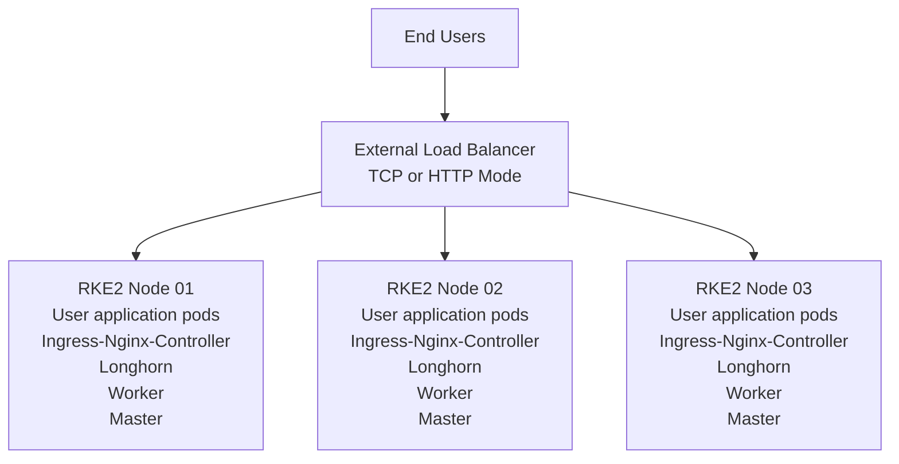
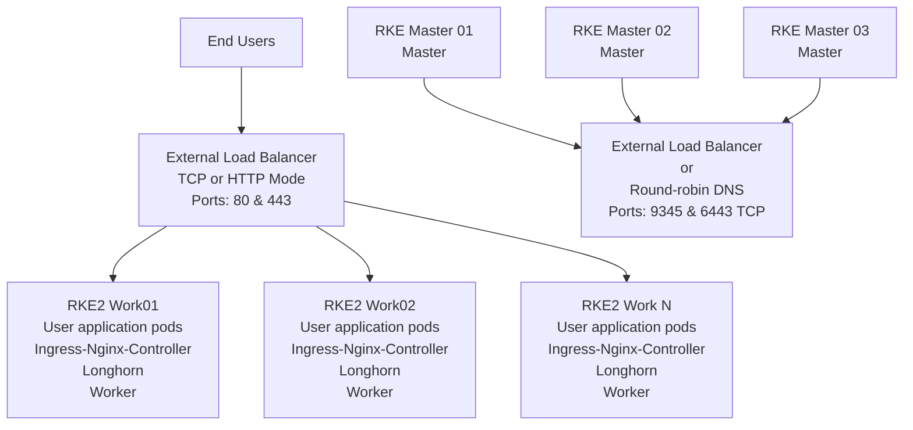
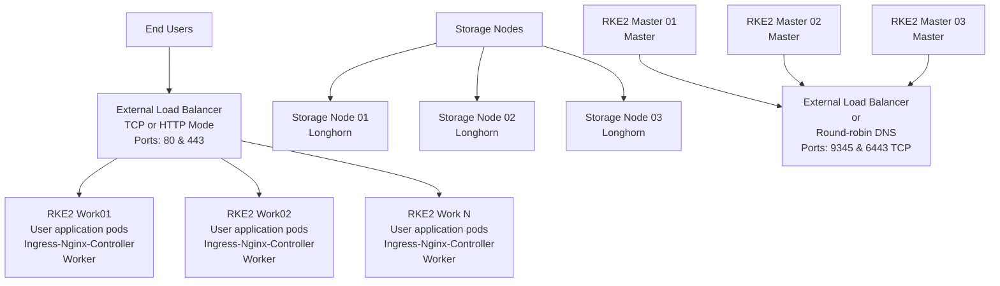

In the world of Kubernetes, managing stateful applications can be a daunting task. That's where Rancher Longhorn comes into play. This blog post will cover what Rancher Longhorn is, its core features, and how it's making life easier for Kubernetes administrators and developers.

<!--more-->

## [Table of Contents](#table-of-contents)

- [What is Longhorn?](#what-is-longhorn)
- [Origins, Architecture, and Purpose](#origins-architecture-and-purpose)
- [Core Features](#core-features)
- [Why Opt for Longhorn?](#why-opt-for-longhorn)
- [How Longhorn Works](#how-longhorn-works)
    - [Control Plane](#control-plane)
    - [Data Plane](#data-plane)
    - [Volume Creation Workflow](#volume-creation-workflow)
    - [Space Allocation](#space-allocation)
    - [Replica Management](#replica-management)
    - [Exposing Volumes](#exposing-volumes)
    - [Additional Features](#additional-features)
    - [ReadWriteMany (RWX) Support](#readwritemany-rwx-support)
    - [Performance Benchmarking](#performance-benchmarking)
- [Pros and Cons of Longhorn](#pros-and-cons-of-longhorn)
    - [Pros](#pros)
    - [Cons](#cons)
- [Rules for Architecting a Longhorn Solution](#rules-for-architecting-a-longhorn-solution)
    - [Pre-Design Considerations](#pre-design-considerations)
        - [Basic Design](#basic-design)
            - [Pros](#basic-design---pros)
            - [Cons](#basic-design---cons)
        - [Advanced Design](#advanced-design)
            - [Pros](#advanced-design---pros)
            - [Cons](#advanced-design---cons)
        - [Decoupled Design](#decoupled-design)
            - [Pros](#decoupled-design---pros)
            - [Cons](#decoupled-design---cons)
- [How Do Longhorn Upgrades Work?](#how-do-longhorn-upgrades-work)
    - [Preparing for Upgrade](#preparing-for-upgrade)
    - [Upgrade Process](#upgrade-process)
        - [Upgrading Engines](#upgrading-engines)
            - [Offline vs Live Upgrade](#offline-vs-live-upgrade)
- [Troubleshooting Tips](#troubleshooting-tips)
- [Getting Started](#getting-started)
- [How to Monitor Longhorn?](#how-to-monitor-longhorn)
- [FAQ](#faq)
    - [What is the maximum size for a Longhorn volume?](#what-is-the-maximum-size-for-a-longhorn-volume)
    - [Can Longhorn be used outside of Kubernetes?](#can-longhorn-be-used-outside-of-kubernetes)
    - [Does Longhorn support Windows nodes?](#does-longhorn-support-windows-nodes)
- [Conclusion](#conclusion)

## [What is Longhorn?](#what-is-longhorn)

Longhorn stands as a distributed block storage system designed specifically for Kubernetes clusters. It mirrors the Rancher ethos by being free, open-source, and actively developed as an incubating project within the CNCF. Longhorn is pivotal in providing persistent storage solutions for workloads within a Kubernetes cluster. This includes providing raw block storage, ReadWriteOnce, and ReadWriteMany volumes, accompanied by robust backup capabilities and cross-cluster disaster recovery support.

However, one of Longhorn's standout features lies in its ability to streamline distributed block storage. It achieves this by adopting a microservices architecture, distinguishing itself from traditional "big iron" storage systems characterized by large storage blocks with limited controllers. In the Longhorn paradigm, each volume is empowered with a dedicated storage controller, essentially transforming into a microservice referred to as the Longhorn engine, a concept we'll delve into later in this post.

Another compelling aspect of Longhorn is its seamless integration with Kubernetes, elevating it above many external storage providers like NFS or cloud-based solutions that often necessitate extensive configuration and management by dedicated storage teams. A key advantage of Longhorn is its independence from cloud providers for block storage, liberating users from cloud-specific constraints. Unlike cloud providers such as AWS, where you might rely on the Amazon EBS storage provisioner, Longhorn transcends these limitations. It operates equally well on physical servers in data centers or VMs in the cloud.

Moreover, Longhorn's distributed block storage prowess shines through its data replication capabilities. Unlike traditional "big iron" storage systems that require meticulous configuration of RAID groups and LUNs, Longhorn simplifies data replication. It treats each disk as an independent filesystem, foregoing the need for complex RAID setups. Node-based replication safeguards your data, while the flexibility to reconfigure storage without impacting applications is a significant advantage.

Longhorn's unique approach to high availability (HA) sets it apart. Traditional storage systems often rely on a pair of storage controllers running in Active/Standby or Active/Active configurations. While these offer redundancy, they become vulnerable in the event of a controller failure or maintenance downtime. Longhorn redefines HA by making upgrades seamless. An upgrade involves rolling out a new container image incrementally, eliminating the complexities associated with traditional storage upgrades. We'll explore this upgrade process in detail in the "How do Longhorn upgrades work?"

With a clear understanding of Longhorn's core attributes, the next section will delve into the intricate components and inner workings of Longhorn.

## [Origins, Architecture, and Purpose](#origins-architecture-and-purpose)

Longhorn's journey traces its roots back to Rancher Labs, where it first emerged as an open-source initiative in 2014. The driving mission behind Longhorn was resolute: to simplify, optimize, and democratize the management of persistent storage volumes within Kubernetes environments. What initially began as an internal project within the confines of Rancher Labs soon burgeoned into a formidable force in container orchestration and storage solutions.

In a transformative move that solidified its significance within the Kubernetes ecosystem, Longhorn found its new home within the Cloud Native Computing Foundation (CNCF) in 2020. This pivotal transition marked a significant milestone in Longhorn's evolution, aligning it with the broader community of cloud-native enthusiasts, developers, and organizations committed to advancing container technologies. Cementing its position within the CNCF underscored Longhorn's commitment to open collaboration, innovation, and the shared pursuit of excellence in Kubernetes storage.

This journey, from its humble beginnings at Rancher Labs to its esteemed place within the CNCF, exemplifies Longhorn's unwavering dedication to enhancing the storage landscape for Kubernetes environments. It is a testament to the power of open-source initiatives and community-driven innovation, with Longhorn at the forefront of revolutionizing how Kubernetes administrators and developers manage their persistent storage needs.

## [Core Features](#core-features)

Rancher Longhorn offers a variety of features that make it a go-to solution for Kubernetes storage:

1. **Easy Installation**: With just a few kubectl commands, Longhorn can be installed into any Kubernetes cluster.
2. **Automatic Backup**: Automated backups can be scheduled to various locations, such as S3, NFS, or any RWX storage.
3. **Volume Snapshotting**: Take snapshots of your volumes for data recovery, cloning, or migration.
4. **High Availability**: Longhorn automatically replicates data and handles node failures, ensuring your data is always available.
5. **GUI Management**: Manage your storage with an easy-to-use graphical user interface that integrates directly into Kubernetes dashboards.

## [Why Opt for Longhorn?](#why-opt-for-longhorn)

Rancher Longhorn stands out as a compelling choice for your storage needs, offering a multitude of advantages over traditional storage solutions:

- **Scalability**: Longhorn leverages a microservices-based architecture, ensuring exceptional scalability that seamlessly aligns with the growth of your Kubernetes deployments.

- **Cost-Efficiency**: As an open-source solution adept at converting any network storage into block storage, Longhorn is a cost-effective option, ideal for organizations mindful of their budgets.

- **Community and Enterprise Backing**: Longhorn enjoys robust support from a vibrant community and extends its reach by providing enterprise-level support, ensuring reliability for mission-critical deployments.

- **Effortless Volume Backup**: Longhorn simplifies data protection with built-in backup capabilities. It allows you to create and schedule automated backups, offering peace of mind for data recovery, disaster preparedness, and migration purposes.

- **Cross-Cluster Replication**: Longhorn goes beyond data backups, facilitating cross-cluster replication of volumes. This feature enhances data availability and resilience, making it a valuable asset for business continuity strategies.

- **Hardware-Agnostic**: Longhorn operates as a pod within Kubernetes clusters, eliminating the need for specialized hardware. This flexibility means you can harness its capabilities, whether on physical servers in a data center or virtual machines in the cloud.

These multifaceted benefits collectively make Rancher Longhorn a versatile and robust storage solution designed to simplify and enhance your Kubernetes storage management.

## [How Longhorn Works](#how-longhorn-works)

Longhorn is fundamentally composed of two layers: the control plane and the data plane. The control plane comprises Longhorn managers, while the data plane comprises Longhorn engines.

### [Control Plane](#control-plane)

The control plane is built upon a set of pods known as Longhorn managers, which are daemonsets running on all nodes within the Kubernetes cluster. These managers handle:

- Cluster volume management and creation
- API calls from Longhorn UI and volume plugins
- Orchestration of Longhorn pods, including Longhorn engine pods

Longhorn follows Rancher's operator model, deploying Custom Resource Definitions (CRDs) monitored by the Longhorn managers. These managers observe the Kubernetes API for changes in CRD specs and take appropriate actions.

### [Data Plane](#data-plane)

The data plane involves Longhorn engine pods that run on each node in the cluster. These pods perform tasks like:

- Creating replicas
- Presenting storage to pods

### [Volume Creation Workflow](#volume-creation-workflow)

1. A user creates a Persistent Volume Claim (PVC) specifying a Longhorn storageclass.
2. Longhorn manager pods initiate the volume creation process.
3. A Longhorn engine is assigned to the volume.
4. Replicas are created and distributed across nodes and disks in the cluster.

**Note**: The default number of replicas is three, which can be configured to any desired number.

### [Space Allocation](#space-allocation)

It's essential to understand the space allocation method used by Longhorn. It uses the' Fallocate' Linux system to manage disk space, allowing for efficient space utilization.

**Warning**: Once allocated, the space remains consumed for the life of the volume. [Feature request for space reclamation](https://github.com/longhorn/longhorn/issues/836)

### [Replica Management](#replica-management)

Each replica runs as a unique Linux process within a Longhorn engine. All replicas are equal peers, capable of handling read and write operations.

### [Exposing Volumes](#exposing-volumes)

Volumes are exposed to the pod through an iSCSI target server created by the Longhorn engine via a Cluster IP. The nodes in the cluster then connect to the engine via an iSCSI initiator. This allows the node to mount the volume as a block device. It is important to note that the iSCSI target server is only accessible from within the cluster IE on the overlay network. Also, the engine runs on the same node as the pod, consuming the volume so that the iSCSI traffic never leaves the node. This is also why there is no need for a HA pair of controllers, as you would see in a traditional storage array.

### [Additional Features](#additional-features)

As of version v1.1.0, Longhorn also supports ReadWriteMany (RWX) volumes. This is implemented via a share manager pod that exposes the volume as an NFS share to the cluster.

**Further Reading**: [OpenZFS Github issue regarding FIEMAP support](https://github.com/openzfs/zfs/pull/10408)

### [ReadWriteMany (RWX) Support](#readwritemany-rwx-support)

Longhorn supports ReadWriteMany (RWX), allowing multiple pods to read from and write to the same persistent volume. This is particularly useful for applications that require shared access to a file system. RWX support is enabled by default and uses the same StorageClass, longhorn, but the difference is that the 'ReadWriteMany' access mode is used when provisioning your Persistent Volumes Claim.

Longhorn does this by creating an RWO volume that is mounted to a share-manager pod that runs an NFS server, which then makes an NFS share that is mounted to the pod that is requesting the RWX volume.

### [Performance Benchmarking](#performance-benchmarking)

Longhorn's performance is on par with or exceeds that of traditional SAN or NAS storage solutions. It's built to offer low latency and high throughput, meeting the demands of various workloads. Benchmark tests indicate that Longhorn's read and write speeds are highly competitive, especially regarding IOPS (Input/Output Operations Per Second).

## [Pros and Cons of Longhorn](#pros-and-cons-of-longhorn)

In this section, we discuss the advantages and disadvantages of using Longhorn for your Kubernetes storage needs.

### [Pros](#pros)

1. **Built-in Backup Solution**: Supports snapshots and external backup to S3 or NFS.
2. **Cross-Cluster DR**: Disaster recovery volumes can be backed up in one cluster and restored in another.
3. **System Snapshots**: As of v1.1.1, Longhorn supports rebuilding replicas from existing data. [Read more](https://github.com/longhorn/longhorn/issues/1304).
4. **Scalability**: Longhorn can scale from a small to a large number of nodes.
5. **Versatile Volume Support**: Supports RWO and RWX volumes using the same storage class.
6. **Provider Agnostic**: Works on any infrastructure—on-prem, AWS, GCP, etc.
7. **Cost-Efficiency**: Thin provisioning allows for more efficient use of storage.
8. **Fault Tolerance**: Longhorn is region/zone aware, which enhances its resilience. [Read more](https://longhorn.io/docs/1.2.3/volumes-and-nodes/scheduling/#scheduling-policy).

### [Cons](#cons)

1. **Attachment Issues**: Volumes may get stuck during attaching and detaching.
2. **Size Limitations**: Hardcoded rebuild limit and practical size constraints.
3. **Network Load**: Heavy network usage due to replica data writing.
4. **Disk Latency**: This can cause timeouts and performance issues.
5. **Storage Overhead**: Nested storage virtualization can be inefficient.

**Note**: For VMware deployments, it's recommended to enable data deduplication to mitigate storage inefficiency.

## [Rules for Architecting a Longhorn Solution](#rules-for-architecting-a-longhorn-solution)

In this section, we'll cover some standard designs for Longhorn deployments, along with the pros and cons of each. Every environment is unique and may require specific tuning for optimal performance. Additionally, all CPU, Memory, and Storage sizes mentioned here are starting points and may need adjustment based on your particular needs and workloads.

### [Pre-Design Considerations](#pre-design-considerations)

Before you design your Longhorn solution, you should be able to answer the following questions:

1. **Availability**: What level of availability is required for this cluster and its applications?
2. **Data Center Span**: Will this cluster span multiple data centers in a metro cluster environment?
3. **Latency**: What is the expected latency between nodes in the cluster?
4. **Storage Access**: Do you need only RWO (Read Write Once) storage, or will you also need RWX (Read Write Many)?
5. **App-Specific Redundancy**: Do any of your applications provide their own data replication or redundancy?
6. **Storage network**: Will you be using a dedicated storage network, or will you be using the same network as your application traffic? If so, you should review the documention on [Storage Network](https://longhorn.io/docs/1.5.1/advanced-resources/deploy/storage-network/).

**Note**: Longhorn has an official performance scalability report published at [Longhorn Performance Scalability Report Aug 2020](https://longhorn.io/blog/performance-scalability-report-aug-2020/). Although the information is outdated, it provides valuable metrics for different cluster sizes.

#### [Basic Design](#basic-design)

The basic design is the most straightforward Longhorn deployment. It consists of a three-node cluster with all nodes having all roles. This design is ideal for small clusters with a limited number of applications and workloads. It's also a good starting point for testing and development environments.

##### [Basic Design - Pros](#basic-design---pros)

1. **Simplicity**: Easy to deploy and manage.
2. **Cost-Effective**: Requires minimal resources.
3. **High Availability**: Can tolerate a single node failure.

##### [Basic Design - Cons](#basic-design---cons)

1. **Limited Scalability**: Not suitable for large clusters.
2. **Comingle Roles**: All nodes have all roles, which can lead to performance issues.
3. **Performance**: User application pods, system pods, and Longhorn pods compete for resources.

#### [Advanced Design](#advanced-design)

The advanced design is a more complex Longhorn deployment. It consists of breaking out the management roles of the cluster from the worker roles. This design is ideal for medium to large clusters with many applications and workloads. It's also a good starting point for production environments.

##### [Advanced Design - Pros](#advanced-design---pros)

1. **Scalability**: You can scale as many worker nodes as you want.
2. **Performance**: User application pods and management pods are separated, which improves performance and availability.
3. **Auto-scaling**: Can scale up and down worker nodes based on workload without impacting management nodes.
4. **Efficiency**: You can use the local storage on the worker nodes for Longhorn, which is great for bare metal deployments.

##### [Advanced Design - Cons](#advanced-design---cons)

1. **Complexity**: Requires more resources and configuration.
2. **Filesystem configure**: Different filesystem configuration between worker and management nodes, as only worker nodes will need the Longhorn storage filesystem.
3. **Maintenance**: Requires more maintenance as you have to maintain two different node types.

#### [Decoupled Design](#decoupled-design)

The decoupled design is the most complex Longhorn deployment. It consists of breaking out Longhorn storage nodes into their nodes. This design is ideal for large clusters with many applications and workloads. It's also a good starting point for production environments.

##### [Decoupled Design - Pros](#decoupled-design---pros)

1. **Scalability**: You can scale as many worker nodes as much as you want.
2. **Performance**: User application, management, and longhorn pods are separated, which improves performance and availability.
3. **Auto-scaling**: Can scale up and down worker nodes based on workload without impacting management or storage nodes.
4. **Efficiency**: Allowing you to build storage nodes with many disks for Longhorn but not having to worry about the compute resources needed for user applications.

##### [Decoupled Design - Cons](#decoupled-design---cons)

1. **Complexity**: Requires more resources and configuration.
2. **Filesystem configure**: Different filesystem configurations between worker, management, and storage nodes, as only storage nodes will need the Longhorn storage filesystem.
3. **Maintenance**: Requires more maintenance as you have to maintain three different node types.

## [How Do Longhorn Upgrades Work?](#how-do-longhorn-upgrades-work)

Upgrading Longhorn is similar to upgrading most Kubernetes applications but with a critical difference: Longhorn is not designed to be downgraded. This means that once you initiate an upgrade, you must complete it. Given this constraint, it's crucial to:

- Review the release notes at [Longhorn Releases](https://github.com/longhorn/longhorn/releases)
- Test all upgrades in a lower, non-production environment before moving on to your mission-critical environment.

### Preparing for Upgrade

Regardless of the method you used to install Longhorn—Rancher catalog, kubectl, or Helm—you should use the same procedure for all future upgrades.

### Upgrade Process

Once you begin the upgrade process, Longhorn will upgrade the manager pods. The engine pods, however, are not automatically upgraded; this is managed separately by Longhorn managers.

#### Upgrading Engines

Engine upgrades can be handled in one of two ways:

1. **Manual Upgrade**: By default, engine upgrades are manual and can be done using the steps outlined at [Manual Engine Upgrade](https://longhorn.io/docs/1.5.1/deploy/upgrade/upgrade-engine/).
   
2. **Automatic Upgrade**: If you prefer, you can set up automatic engine upgrades as explained at [Automatic Engine Upgrade](https://longhorn.io/docs/1.5.1/deploy/upgrade/auto-upgrade-engine/).

##### Offline vs. Live Upgrade

- **Offline Upgrade**: In this mode, the volume will be detached from its workload and reattached post-upgrade. This is generally faster but does require a brief period of downtime.
  
- **Live Upgrade**: Here, Longhorn doubles the number of replicas during the upgrade (e.g., three replicas become 6). This means you'll need additional capacity on your storage nodes. A live upgrade also necessitates the rebuilding of all your volumes, requiring extra storage space and I/O resources. **Note**: Live upgrades are only supported on v1.5.x and above.

## [Troubleshooting Tips](#troubleshooting-tips)

Here are some troubleshooting tips if you run into issues with Longhorn:

- **Check Logs**: Longhorn provides detailed logs for its engine, replica, and manager components. Use \`kubectl\` to access these logs for troubleshooting.
- **Disk Pressure**: Ensure enough disk space on the nodes where Longhorn is deployed.
- **Network Issues**: Verify that there's no network partitioning affecting the Longhorn components.
- **Consult Documentation**: The [Longhorn documentation](https://longhorn.io/docs/) is an excellent resource for resolving common issues.

## [Getting Started](#getting-started)

To get started with Rancher Longhorn, you can follow these simple steps:

1. Install Longhorn via Rancher UI or kubectl.
2. Create a StorageClass in Kubernetes.
3. Provision Persistent Volumes and attach them to your workloads.

For detailed installation and setup guides, check out the [official documentation](https://longhorn.io/docs/).

## [How to Monitor Longhorn?](#how-to-monitor-longhorn)

Monitoring Longhorn involves several components, including the Longhorn UI, Prometheus metrics, and Grafana dashboards. You can also leverage built-in Kubernetes monitoring solutions to track performance, capacity, and availability.

1. **Longhorn UI**: A detailed overview of your storage, nodes, and volumes. This is the easiest way to get started with Longhorn monitoring.
  
2. **Prometheus Metrics**: Longhorn exports various metrics that can be scraped by Prometheus, providing a time-series view of your storage layer.
  
3. **Grafana Dashboards**: With the integration of Grafana, you can create custom dashboards to visualize Longhorn metrics, allowing for deep performance analytics and troubleshooting.

For more extensive monitoring and alerting capabilities, you can also integrate Longhorn with third-party solutions like Datadog or Sysdig.

## [FAQ](#faq)

### What is the maximum size for a Longhorn volume?

The underlying storage and configuration determine the maximum size for a Longhorn volume. Generally speaking, Longhorn volumes can go up to several terabytes in size.

### Can Longhorn be used outside of Kubernetes?

While Longhorn is designed primarily for Kubernetes, it's possible to use it in a standalone mode, although it's not a recommended setup.

### Does Longhorn support Windows nodes?

As of now, Longhorn is focused on Linux-based clusters. However, support for Windows nodes is on the roadmap.

## [Conclusion](#conclusion)

Rancher Longhorn is a powerful, feature-rich, and easy-to-use storage solution for Kubernetes. Whether you are a seasoned Kubernetes administrator or starting, Longhorn provides the tools you need to manage stateful applications effortlessly. Give it a try and revolutionize your Kubernetes storage management.
